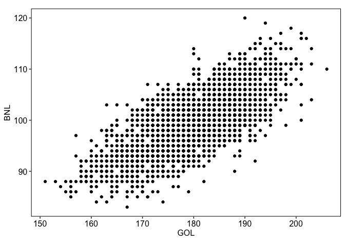
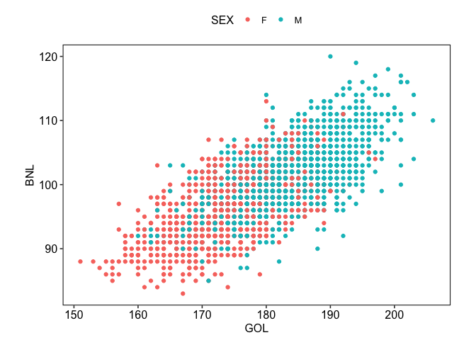
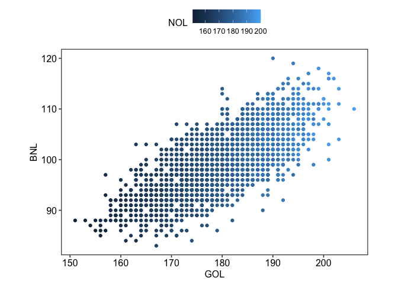
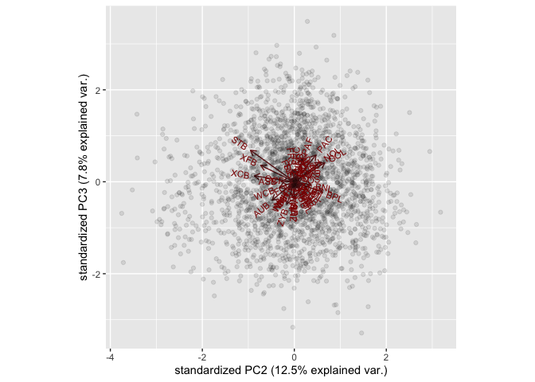
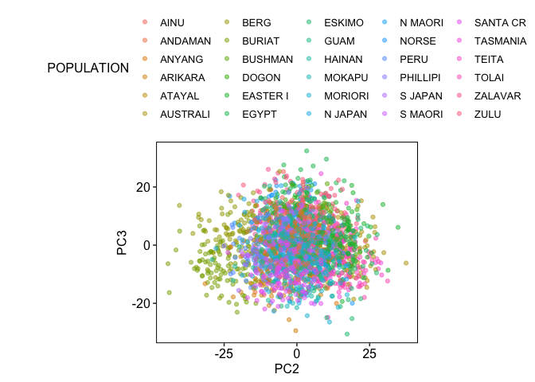
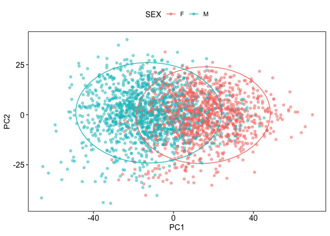
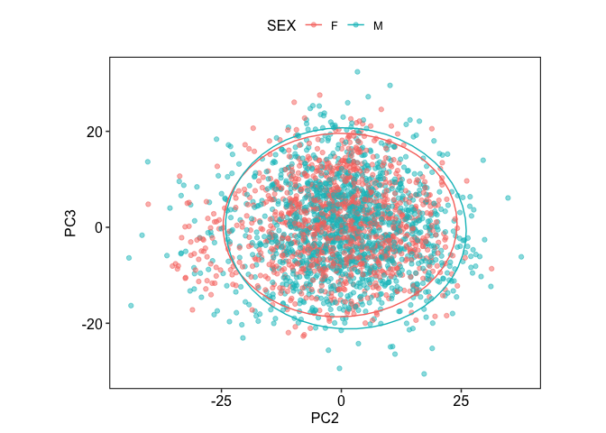
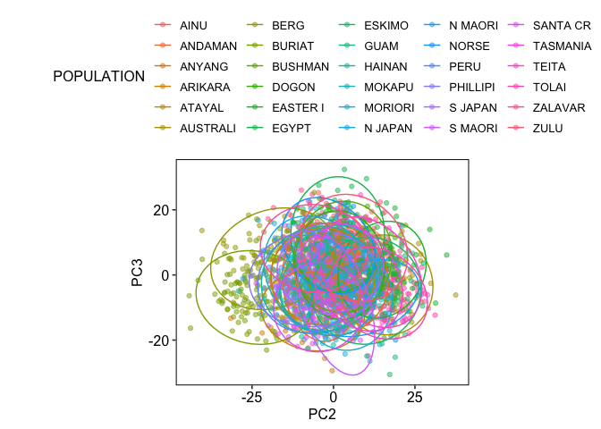
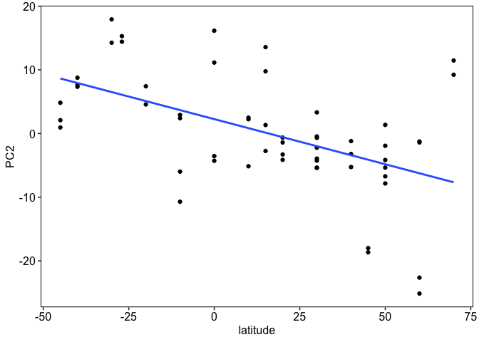

Dimensionality reduction and clustering I
================
Tiena Danner & Steven Moran
(30 November, 2022)

-   <a href="#bivariate-data--a-story-thats-all-too-simple"
    id="toc-bivariate-data--a-story-thats-all-too-simple">Bivariate data – a
    story that’s all too simple?</a>
    -   <a href="#data" id="toc-data">Data</a>
    -   <a href="#plotting-multivariate-data"
        id="toc-plotting-multivariate-data">Plotting multivariate data</a>
        -   <a
            href="#ok-but-how-do-we-plot-more-than-two-variables-in-a-single-plot"
            id="toc-ok-but-how-do-we-plot-more-than-two-variables-in-a-single-plot">Ok,
            but how do we plot more than two variables in a single plot?</a>
        -   <a href="#the-last-resort-3d-plots"
            id="toc-the-last-resort-3d-plots">The last resort: 3D plots…</a>
    -   <a href="#what-is-a-pca" id="toc-what-is-a-pca">What is a PCA?</a>
        -   <a href="#why-pca" id="toc-why-pca">Why PCA?</a>
        -   <a href="#how-does-pca-work" id="toc-how-does-pca-work">How does PCA
            work?</a>
        -   <a href="#pca-in-essence" id="toc-pca-in-essence">PCA in essence</a>
    -   <a href="#computing-a-pca-in-r" id="toc-computing-a-pca-in-r">Computing
        a PCA in R</a>
        -   <a href="#pca-statistics" id="toc-pca-statistics">PCA statistics</a>
        -   <a href="#plotting-a-pca" id="toc-plotting-a-pca">Plotting a PCA</a>
    -   <a href="#correlation-between-pcs-and-other-variables"
        id="toc-correlation-between-pcs-and-other-variables">Correlation between
        PCs and other variables</a>
-   <a href="#references" id="toc-references">References</a>

------------------------------------------------------------------------

This report uses the [R programming
language](https://cran.r-project.org/doc/FAQ/R-FAQ.html) (R Core Team
2021) and the following [R libraries](https://r-pkgs.org/intro.html)
(Wickham et al. 2019; Xie 2021; Irizarry and Gill 2021; Arnold 2021;
Slowikowski 2021; Kassambara and Kassambara 2020; Soetaert 2019; Sievert
2020; Wickham, Hester, and Chang 2020; Vu 2011; Peterson and Carl 2020;
Leisch and Dimitriadou 2010).

``` r
library(tidyverse)
library(knitr)
library(ggpubr)
library(plot3D)
library(plotly)
library(devtools)
install_github("vqv/ggbiplot") # to install an R library from source
library(ggbiplot)
library(PerformanceAnalytics)
library(mlbench)
library(datasets)
```

# Bivariate data – a story that’s all too simple?

Recall the materials on [Linear models](../8_linear_models/). As you
remember, for applying linear models we mostly use **bivariate
relationships**. This means that we are looking for relationships
between only two variables, such as the relationship between brain- and
body size in the animal kingdom. This is totally fine for answering a
lot of scientific questions.


**But what if we have to deal with many more independent variables,
potentially hundreds of them?**

Not all scientific questions may be answered by simply looking at the
relationship between two variables. Possibly, we will have to look at
the influence of many different independent variables on a specific
question. In these cases we can use [multivariate analysis and
statistics](https://en.wikipedia.org/wiki/Multivariate_statistics).

In this chapter we will mainly focus on “**how to visualize multivariate
data**” for recognizing patterns in multivariate data sets and not so
much on the mathematical and statistical details behind them. The most
widely used technique for doing that is [**Principal Components
Analysis**](https://en.wikipedia.org/wiki/Principal_component_analysis)
(PCA).

The main aim of multivariate analysis, and also of PCA, is **pattern
extraction**. This means, we aim to find a scientifically relevant
pattern in potentially hundreds (or sometimes thousands) of numerical
variables. We may summarize the aims of multivariate analysis as
follows:

-   Find trends (covariation) in large data sets and big data
-   Reduce number of variables to a few significant ones (that is where
    PCA comes into play)
-   Discriminate between groups (like different populations, sexes,
    etc.)

The basic idea of this chapter is that you can implement a PCA, a very
fine instrument to do patterns extraction, and interpret the results.
Finally you will apply this to other data sets and hopefully to your own
data.

Now let’s go through a **PCA** in detail – from bottom up!

## Data

Let’s use a large data set with many independent measurements. We will
utilize the [Howells Data](https://web.utk.edu/~auerbach/HOWL.htm). This
data consists of hundreds of standard [craniometric
measurements](https://en.wikipedia.org/wiki/Craniometry) of the [human
skull](figures/craniometry.pdf) of different populations all around the
globe (Howells 1973, 1989, 1995).

Here is an overview of the different populations that were analyzed for
this data set:


If you want to know more details on how the Howells Data was collected
and how it is structured, e.g., especially the abbreviations of the
different measurements, please consult [this
PDF](data/howells_info.pdf).

Now let’s dive into this fantastic data set!

What does a data scientist do? First we have a look at the data!

``` r
howells <- read_csv("data/howells_data.csv")
head(howells) %>% kable()
```

|  ID | SEX | POPULATION | POP | longitude | longitude2 | latitude | GOL | NOL | BNL | BBH | XCB | XFB | ZYB | AUB | WCB | ASB | BPL | NPH | NLH | JUB | NLB | MAB | MDH | MDB | OBH | OBB | DKB | NDS | WNB | SIS | ZMB | SSS | FMB | NAS | EKB | DKS | IML | XML | MLS | WMH | SOS | BLS | STB | FRC | FRS | FRF | PAC | PAS | PAF | OCC | OCS | OCF | FOL |
|----:|:----|:-----------|----:|----------:|-----------:|---------:|----:|----:|----:|----:|----:|----:|----:|----:|----:|----:|----:|----:|----:|----:|----:|----:|----:|----:|----:|----:|----:|----:|----:|----:|----:|----:|----:|----:|----:|----:|----:|----:|----:|----:|----:|----:|----:|----:|----:|----:|----:|----:|----:|----:|----:|----:|----:|
|   1 | M   | NORSE      |   1 |        15 |         15 |       60 | 189 | 185 | 100 | 135 | 143 | 120 | 133 | 119 |  70 | 112 |  96 |  66 |  50 | 118 |  26 |  63 |  31 |  13 |  31 |  42 |  22 |  12 |  10 |   5 |  83 |  20 | 100 |  19 | 100 |   8 |  42 |  57 |  13 |  24 |   7 |   4 | 115 | 118 |  25 |  53 | 119 |  26 |  62 |  98 |  30 |  51 |  34 |
|   2 | M   | NORSE      |   1 |        15 |         15 |       60 | 182 | 178 | 102 | 139 | 145 | 120 | 137 | 125 |  66 | 113 | 108 |  64 |  48 | 118 |  25 |  72 |  19 |  13 |  28 |  39 |  21 |   9 |  11 |   4 | 101 |  27 |  95 |  17 |  96 |   9 |  32 |  53 |  10 |  23 |   6 |   4 | 117 | 116 |  28 |  55 | 113 |  24 |  59 |  93 |  27 |  39 |  34 |
|   3 | M   | NORSE      |   1 |        15 |         15 |       60 | 191 | 187 | 102 | 123 | 140 | 114 | 134 | 125 |  74 | 112 | 102 |  67 |  53 | 112 |  23 |  65 |  28 |  14 |  33 |  41 |  20 |  13 |   8 |   4 |  90 |  24 |  98 |  19 |  97 |  10 |  35 |  56 |  10 |  24 |   6 |   4 | 112 | 107 |  25 |  47 | 118 |  23 |  59 |  88 |  30 |  45 |  41 |
|   4 | M   | NORSE      |   1 |        15 |         15 |       60 | 191 | 188 | 100 | 127 | 141 | 123 | 135 | 127 |  71 | 113 |  95 |  76 |  53 | 114 |  26 |  62 |  25 |  12 |  35 |  40 |  23 |  10 |   9 |   4 |  94 |  23 |  98 |  16 |  99 |   8 |  34 |  52 |  11 |  22 |   8 |   3 | 116 | 109 |  26 |  47 | 116 |  24 |  57 |  94 |  34 |  50 |  38 |
|   5 | M   | NORSE      |   1 |        15 |         15 |       60 | 178 | 177 |  97 | 128 | 138 | 117 | 129 | 121 |  69 | 111 |  90 |  67 |  51 | 115 |  24 |  64 |  26 |  14 |  32 |  39 |  21 |  11 |   9 |   5 |  91 |  21 |  96 |  18 |  97 |  10 |  35 |  52 |  12 |  27 |   5 |   2 | 116 | 102 |  22 |  45 | 113 |  26 |  62 |  94 |  32 |  40 |  34 |
|   6 | M   | NORSE      |   1 |        15 |         15 |       60 | 194 | 191 | 106 | 132 | 139 | 118 | 136 | 128 |  76 | 112 | 102 |  69 |  50 | 117 |  25 |  65 |  29 |  13 |  33 |  40 |  22 |  13 |   8 |   3 |  91 |  22 | 101 |  20 |  98 |  11 |  38 |  57 |  10 |  23 |   6 |   3 | 115 | 107 |  23 |  49 | 115 |  26 |  58 | 103 |  34 |  47 |  35 |

``` r
nrow(howells)
```

    ## [1] 2524

``` r
ncol(howells)
```

    ## [1] 54

OK, this is quite some data. 2524 rows (subjects) and 54 measurement
variables (columns). How can we visualize the entirety of these
variables in a simple x/y coordinate system? **Seems impossible,
right?** Let’see…

## Plotting multivariate data

First, let’s produce a simple bivariate plot

``` r
ggplot(howells, aes(x = GOL, y = BNL)) +
  geom_point() +
  coord_equal() +
  theme_pubr(border = TRUE, margin = TRUE)
```

<!-- -->

What did we do here? We simply plotted two variables (BNL \~ GOL), which
gives us a bivariate plot. You can already see that these two
measurements appear to be
**[correlated](https://en.wikipedia.org/wiki/Correlation)**. This is
probably due to the fact that both these measurements (*basion-nasion
length* and *glabella-occipital length*) are related to overall body
size, i.e., the larger a person is, the larger their GOL and BNL will
be. (Don’t know what BNL and GOL are – search the Web! :)

You might wonder why we used the commands `cord_equal()` and
`theme_pubr(border = TRUE, margin = TRUE)` in our `ggplot()` statement.
Here’s why:

-   `cord_equal()` produces isometrically scaled axes. This is very
    important when plotting data that have similar scale on both axes
    (e.g,. mm here). A distance in X should always be equal to a
    distance in Y! (Always do this for a PCA!)
-   `theme_pubr(border = TRUE, margin = TRUE)` produces a nice
    “publication ready” theme from the
    [ggpubr](https://cran.r-project.org/web/packages/ggpubr/index.html)
    package. Maybe you like it, maybe not. It’s totally up to you if you
    want to use this theme or not! Recall themes from our lecture on
    [data visualizations](../6_data_visualization#theme).

### Ok, but how do we plot more than two variables in a single plot?

If the third variable you want to visualize is a categorical variable
(such as `SEX`), it’s easy! You simply add a grouping variable. But you
probably already know how this works from previous lectures!

``` r
ggplot(howells, aes(x = GOL, y = BNL, color = SEX)) +
  geom_point() +
  coord_equal() +
  theme_pubr(border = TRUE, margin = TRUE)
```

<!-- -->

And even if it is a numerical variable, it’s possible to visualize the
“third” variable.

``` r
ggplot(howells, aes(x = GOL, y = BNL, color = NOL)) +
  geom_point() +
  coord_equal() +
  theme_pubr(border = TRUE, margin = TRUE)
```

<!-- -->

### The last resort: 3D plots…

Your last resort of visualizing more than two variables should be 3D
plots. The package
[plot3D](http://www.sthda.com/english/wiki/impressive-package-for-3d-and-4d-graph-r-software-and-data-visualization)
allows you to plot 3D data with the function `scatter3D()`

``` r
scatter3D(howells$GOL, howells$BBH, howells$BNL, col = c("#1B9E77"), bty = "g", pch = 18)
```

<!-- -->

Static 3D plots are often not a good choice, due to these reasons:

-   Hard to define the exact X,Y & Z position of a specific data point.
-   Data points often obscure each other.
-   The plot cannot be rotated.

Interactive 3D plots can be created with the package
[plotly](https://plotly.com/r/) and may address some of these issues.

**Note that this is an HTML widget and it will not render in the
markdown output!** If you want to take a look, run your code in the
`.Rmd` file.

``` r
plot_ly(y = howells$GOL, z = howells$BBH, x = howells$XCB, type = "scatter3d", mode = "markers", text = howells$POPULATION, color = howells$SEX)
```

Also note that this plot may be rotated and the variation is much more
visible! Cool, huh?

In general, we suggest to use 3D graphs only for **exploratory**
purposes and not to communicate your results. There are several reasons
why to avoid plotting your data in 3D. Consult this web page if you want
to know more about [why not to go
3D](https://clauswilke.com/dataviz/no-3d.html).

## What is a PCA?

Enough with the 3D graphs (as said – we do not really fancy 3D scatter
plots). **We actually might not need them if we can apply a nice PCA!**
But how does a PCA work and what are the statistical procedures behind
it? We won’t go into all the technical details and mathematics behind a
PCA, but to get an overview of how it works, watch [this
video](figures/PCA_main_ideas.mp4) (**attention**: if you click this
link you will be forwarded to a GitHub webpage that will say: *(Sorry
about that, but we can’t show files that are this big right now.)*;
instead just click *View Raw* and you will be able to watch the video
directly on GitHub – cool trick, eh?). If you want the YouTube URL,
[here](https://www.youtube.com/watch?v=HMOI_lkzW08) you go!

For a detailed tutorial of a PCA in R, see
[here](https://www.datacamp.com/community/tutorials/pca-analysis-r). But
we will go through the most important steps ourselves in this script.

**Note**: for running a PCA we will use the package `ggbiplot`. To
install it, make sure that you run this command:
`install_github("vqv/ggbiplot")` to install it directly from GitHub. For
that, you will need to load the package `devtools` –\> see first code
chunk of this script for an example.

### Why PCA?

Here are some **important** reasons why PCA is often a good choice to
analyze multivariate data sets (Zelditch, Swiderski, and Sheets 2012):

-   Principal components analysis is a commonly used **dimensionality
    reduction technique**.
-   The purpose of PCA is to **simplify patterns** where we have
    multivariate data sets, and to make them easily visible by
    **replacing** the original variables with a few **new ones** (so
    called principal components, or simply ‘PCs’).
-   These resulting PCs are linear combinations of the original
    variables and are **statistically independent** of each other.
-   Only with a **few variables** (e.g., the PCs), **most of the
    variation** in a given sample can be explained. This means, that
    only by plotting PC1 & PC2 (a bivariate plot!) we may have over 50%
    of variation in a sample visualized in a simple graph.
-   PCA simplifies the description of **differences between
    individuals**. In PC plots, we will often see patterns of
    **clustering of different groups**. Finding these groups can be very
    valuable, even if they do not represent statistically different
    entities.

### How does PCA work?

As mentioned before, we will not go into the technical details of how a
PCA works. You have already seen most of the important steps in the
video above. Nevertheless, let’s quickly summarize how PCA works from a
geometric (visual) point of view.

That take a look at the following **graphic**:


What you see here is a simple **3D plot** of three observed traits
(let’s call them X1, X2 and X3). These traits may be simple distance
measurements, as we find them in the Howells data set. Each point in the
**scatter plot** represents the three measurement values observed for
each individual in the sample. The distribution of values in this graph
may be summarized by an **ellipse** (black dashed ellipse) that is
tilted along the X1 / X3 plane.

**PCA** solves for the axes of this ellipse and uses these new axes to
describe the positions of individuals within that ellipse, i.e., the
newly acquired “space”. The ultimate **goal of PCA** is to find the
**directions** within that scatter that describe the **largest
proportions of variance** (aka PC1), the second largest proportion of
variance (PC2), PC3, and so on. These directions are indicated by the
orange arrows in the graphic. In this example we get three PCs in the
end, since we only have 3 original variables.

In sum, the resulting PCs describe the major directions of largest
proportions of variance in each direction within this data scatter
ellipse. Each new direction will be orthogonal to the latter directions.
This explains why all PCs are totally independent of each other, i.e.,
they describe each in a different pattern of variation in the sample.

### PCA in essence

-   PCA is a statistical procedure that converts a set of observations
    of possibly correlated variables into a set of values of linearly
    uncorrelated variables called principal components.
    ([Wikipedia](https://en.wikipedia.org/wiki/Principal_component_analysis))
-   PCA will help us to find a reduced number of features that will
    represent our original data set in a compressed way, capturing up to
    a certain portion of its variance depending on the number of new
    features we end up selecting
    ([Towardsdatascience](https://towardsdatascience.com/the-most-gentle-introduction-to-principal-component-analysis-9ffae371e93b)).

------------------------------------------------------------------------

**BUT** (there is always a but): Keep in mind that PCA (and other
dimensionality reduction techniques) are statistical procedures and the
resulting PCs do not necessarily correspond to (biologically) relevant
patterns of variation. Therefore, **always be careful how you interpret
your PCA** and be cautious of faulty conclusions. PCA merely extracts
patterns of variation in a sample and helps you to visualize these
patterns! This is also why it is a often used technique for data
exploration.

## Computing a PCA in R

**Now let’s get our hands dirty and do that PCA in R!**

For computing the PCA in R, we will use the function `prcomp`, which is
in the core package `stats`. Note that PCA will only work with
**numerical input**. So make sure not to include [categorical
variables](https://github.com/bambooforest/IntroDataScience/tree/main/3_data#data-types-in-statistics)!
The argument `scale = FALSE` means that the PCA is performed on the
variance-covariance matrix. This is advisable when all variables have
the same measurement dimensions (in the Howells data: millimeters). The
argument `scale=TRUE` means that the PCA is performed on the correlation
matrix, i.e., all variances are scaled to 1. This is advisable when
variables have different dimensions (such as length, temperature, mass,
etc.).

``` r
data.pca <- prcomp(data.frame(howells[, 8:54]), scale = FALSE)
```

The output of `prcomp()` gives us a list of data – mostly `x` will be
important – which are the resulting PC scores. You can access the PC
scores, or any other of the data entries by using the `$` operator. For
example, if you want to access the PC scores, you can use `data.pca$x`,
or if you want the standard deviations of the PCs you prompt
`pca.data$sdev` and so on…

### PCA statistics

Let’s print some basic statistics of this PCA:

``` r
summary(data.pca)
```

    ## Importance of components:
    ##                            PC1     PC2     PC3     PC4     PC5     PC6     PC7
    ## Standard deviation     21.5247 11.7984 9.28908 7.78752 6.87578 5.79972 5.38208
    ## Proportion of Variance  0.4164  0.1251 0.07755 0.05451 0.04249 0.03023 0.02603
    ## Cumulative Proportion   0.4164  0.5415 0.61908 0.67359 0.71608 0.74631 0.77235
    ##                            PC8     PC9    PC10   PC11    PC12    PC13    PC14
    ## Standard deviation     4.78064 4.65575 4.40064 4.1264 3.96997 3.77271 3.58587
    ## Proportion of Variance 0.02054 0.01948 0.01741 0.0153 0.01417 0.01279 0.01156
    ## Cumulative Proportion  0.79289 0.81237 0.82977 0.8451 0.85924 0.87204 0.88359
    ##                           PC15    PC16    PC17    PC18    PC19    PC20    PC21
    ## Standard deviation     3.44398 3.39386 3.16782 3.03999 2.94370 2.85841 2.48585
    ## Proportion of Variance 0.01066 0.01035 0.00902 0.00831 0.00779 0.00734 0.00555
    ## Cumulative Proportion  0.89425 0.90461 0.91363 0.92193 0.92972 0.93706 0.94262
    ##                           PC22   PC23    PC24    PC25    PC26    PC27    PC28
    ## Standard deviation     2.40999 2.3121 2.22112 2.16636 2.03883 1.99636 1.92177
    ## Proportion of Variance 0.00522 0.0048 0.00443 0.00422 0.00374 0.00358 0.00332
    ## Cumulative Proportion  0.94784 0.9526 0.95708 0.96129 0.96503 0.96861 0.97193
    ##                           PC29    PC30    PC31    PC32    PC33    PC34    PC35
    ## Standard deviation     1.77611 1.73146 1.65840 1.64144 1.61139 1.51998 1.45092
    ## Proportion of Variance 0.00284 0.00269 0.00247 0.00242 0.00233 0.00208 0.00189
    ## Cumulative Proportion  0.97477 0.97746 0.97993 0.98235 0.98469 0.98676 0.98866
    ##                           PC36    PC37    PC38   PC39    PC40    PC41    PC42
    ## Standard deviation     1.38396 1.33195 1.27707 1.2047 1.05122 1.03400 0.99116
    ## Proportion of Variance 0.00172 0.00159 0.00147 0.0013 0.00099 0.00096 0.00088
    ## Cumulative Proportion  0.99038 0.99197 0.99344 0.9947 0.99574 0.99670 0.99758
    ##                           PC43    PC44    PC45    PC46    PC47
    ## Standard deviation     0.91322 0.83452 0.71459 0.58654 0.55415
    ## Proportion of Variance 0.00075 0.00063 0.00046 0.00031 0.00028
    ## Cumulative Proportion  0.99833 0.99896 0.99941 0.99972 1.00000

In this output you can see the **“Importance of components”**, e.g., how
much of the **total variance** in the sample that the PCs explain. You
can see that PC1 and PC2 together already explain 54.15% of the full
variance in this sample!

You may visualize the explained variances by each PCs easily with a
[screeplot](https://en.wikipedia.org/wiki/Scree_plot).

``` r
ggscreeplot(data.pca)
```

<!-- -->

Furthermore, we can visualize to what extent each characteristic (i.e.,
your original variables) **influence** a specific PC. For that we may
use a `biplot`, which can be produced with `ggbiplot()`.

``` r
ggbiplot(data.pca, choices = 1:2, alpha = 0.1)
```

<!-- -->

``` r
ggbiplot(data.pca, choices = 2:3, alpha = 0.1)
```

<!-- -->

On a **biplot**, you can see the data scatter of the PCs, depending on
which PCs you want to visualize (e.g., PC scores 1-2: `choices:1:2`). In
addition to the observations, the biplot shows the **original
variables** (input variables) as vectors (red arrows). These vectors may
be interpreted as follows (Rossiter 2014):

-   The **orientation** (direction) of the vector, with respect to the
    principal component space, in particular, its angle with the
    principal component axes: *the more parallel to a principal
    component axis a vector is, the more it contributes only to that
    PC.*
-   The **length** in the space: *the longer the vector, the more
    variability of this variable is represented by the two displayed
    principal components; short vectors are thus better represented in
    other dimensions.*
-   The **angles** between vectors of different variables show their
    correlation in this space: *small angles represent high positive
    correlation, right angles represent lack of correlation, opposite
    angles represent high negative correlation.*

#### Which PCs are relevant for further investigation?

A good rule of thumb is to use PCs that explain **more than 5% of total
variance** for visualization. The rest of the PCs may be ignored, since
they explain only “small amounts” of variation. In our case, we would
focus on PCs 1-4.

Another option is to take a look at the **scree plot** and deem all the
PCs as relevant that occur before the so-called “edge” in the scree plot
curve (in this example around PC4 or PC5). Note that these suggestions
are merely **rules of thumb** and not absolute truths! They simply have
become “statistical practice”, just like setting the significance
threshold of the p-value to 0.05… but that is another story, see e.g.,
if you’re interested:

-   <https://www.ncbi.nlm.nih.gov/pmc/articles/PMC5017929/>
-   <https://sites.uw.edu/stlab/2016/03/09/the-arbitrary-magic-of-p-0-05/>
-   <https://towardsdatascience.com/p-values-explained-by-data-scientist-f40a746cfc8>

### Plotting a PCA

Now **let’s plot** the actual PCs to look for patterns in the data. For
that we must first store the relevant PC scores (PCs 1-4) in an
accessible data format, such as a data frame. We can simply add PCs 1-4
to the original data using `cbind()`.

``` r
howells_PCA <- cbind(howells, data.pca$x[, 1:4])
```

Now we can plot the PCs using `ggplot`.

``` r
ggplot(howells_PCA, aes(x = PC1, y = PC2)) +
  geom_point() +
  coord_equal() +
  theme_pubr(border = TRUE, margin = TRUE)
```

<!-- -->

The actual **values** of the PC scores are **arbitrary** and cannot be
interpreted in any sense. They are resulting from the statistical
procedures we described above.

Let’s use grouping variables.

``` r
ggplot(howells_PCA, aes(x = PC1, y = PC2, color = SEX)) +
  geom_point() +
  coord_equal() +
  theme_pubr(border = TRUE, margin = TRUE)
```

<!-- -->

``` r
ggplot(howells_PCA, aes(x = PC1, y = PC2, color = POPULATION)) +
  geom_point(alpha = 0.5) +
  coord_equal() +
  theme_pubr(border = TRUE, margin = TRUE)
```

<!-- -->

``` r
ggplot(howells_PCA, aes(x = PC2, y = PC3, color = POPULATION)) +
  geom_point(alpha = 0.5) +
  coord_equal() +
  theme_pubr(border = TRUE, margin = TRUE)
```

<!-- -->

You can also use statistical ellipses to find patterns, e.g., to look
for group differences.

``` r
ggplot(howells_PCA, aes(x = PC1, y = PC2, color = SEX)) +
  geom_point(alpha = 0.5) +
  coord_equal() +
  stat_ellipse() +
  theme_pubr(border = TRUE, margin = TRUE)
```

<!-- -->

``` r
ggplot(howells_PCA, aes(x = PC2, y = PC3, color = SEX)) +
  geom_point(alpha = 0.5) +
  coord_equal() +
  stat_ellipse() +
  theme_pubr(border = TRUE, margin = TRUE)
```

<!-- -->

``` r
ggplot(howells_PCA, aes(x = PC2, y = PC3, color = POPULATION)) +
  geom_point(alpha = 0.5) +
  coord_equal() +
  stat_ellipse() +
  theme_pubr(border = TRUE, margin = TRUE)
```

<!-- -->

## Correlation between PCs and other variables

For looking at **correlations**, it is easier to get fewer data points
for each population. So first, we `summarize()` the data. You already
know how to do that from chapter 4: [data
wrangling](../4_data_wrangling/). Note that we also calculate the
**cosine of latitude**, which is an approximation of mean annual
temperature. So here we go:

``` r
cos.latitude <- cos(howells_PCA$latitude * pi / 180.0)
howells_PCA[, "cosine.latitude"] <- cos.latitude
howells_PCA_mean <- howells_PCA[, -1] %>%
  group_by(POPULATION, SEX) %>%
  summarise_if(is.numeric, mean, na.rm = TRUE)
```

Sometimes it might be interesting to test if PCs (patterns of variation)
are related to certain other variables, such as temperature, longitude,
latitude, etc., in our example.

We can look for these correlations with a [correlation
matrix](http://www.sthda.com/english/wiki/correlation-matrix-a-quick-start-guide-to-analyze-format-and-visualize-a-correlation-matrix-using-r-software).

``` r
chart.Correlation(howells_PCA_mean[c("PC1", "PC2", "PC3", "PC4", "cosine.latitude", "longitude", "latitude")])
```

<!-- -->

PC2 shows a significant correlation with latitude.

``` r
ggplot(howells_PCA_mean, aes(x = latitude, y = PC2)) +
  geom_point() +
  geom_smooth(method = "lm", se = FALSE) +
  theme_pubr(border = TRUE, margin = TRUE)
```

    ## `geom_smooth()` using formula 'y ~ x'

<!-- -->

# References

<div id="refs" class="references csl-bib-body hanging-indent">

<div id="ref-ggthemes" class="csl-entry">

Arnold, Jeffrey B. 2021. *Ggthemes: Extra Themes, Scales and Geoms for
’Ggplot2’*. <https://CRAN.R-project.org/package=ggthemes>.

</div>

<div id="ref-Howells1973" class="csl-entry">

Howells, William W. 1973. “Cranial Variation in Man. A Study by
Multivariate Analysis of Patterns of Differences Among Recent Human
Populations.” *Papers of the Peabody Museum of Archeology and Ethnology*
67: 259.

</div>

<div id="ref-Howells1989" class="csl-entry">

———. 1989. “Skull Shapes and the Map. Craniometric Analyses in the
Dispersion of Modern Homo.” *Papers of the Peabody Museum of Archeology
and Ethnology* 79: 189.

</div>

<div id="ref-Howells1995" class="csl-entry">

———. 1995. “Who’s Who in Skulls. Ethnic Identification of Crania from
Measurements.” *Papers of the Peabody Museum of Archeology and
Ethnology* 82: 108.

</div>

<div id="ref-IrizarryGill2021" class="csl-entry">

Irizarry, Rafael A., and Amy Gill. 2021. *Dslabs: Data Science Labs*.
<https://CRAN.R-project.org/package=dslabs>.

</div>

<div id="ref-ggpubr" class="csl-entry">

Kassambara, Alboukadel, and Maintainer Alboukadel Kassambara. 2020.
*Package “Ggpubr”*. *R Package Version 0.1*. Vol. 6.

</div>

<div id="ref-mlbench" class="csl-entry">

Leisch, Friedrich, and Evgenia Dimitriadou. 2010. “Machine Learning
Benchmark Problems.” *R Package, Mlbench*.

</div>

<div id="ref-performanceanalytics" class="csl-entry">

Peterson, Brian G., and Peter Carl. 2020. *PerformanceAnalytics:
Econometric Tools for Performance and Risk Analysis*.
<https://CRAN.R-project.org/package=PerformanceAnalytics>.

</div>

<div id="ref-R" class="csl-entry">

R Core Team. 2021. *R: A Language and Environment for Statistical
Computing*. Vienna, Austria: R Foundation for Statistical Computing.
<https://www.R-project.org/>.

</div>

<div id="ref-Rossiter2014" class="csl-entry">

Rossiter, David G. 2014. *Tutorial: Using the r Environment for
Statistical Computing: An Example with the Mercer-Hall Wheat Yield
Dataset*. University of Twente (UT).

</div>

<div id="ref-plotly" class="csl-entry">

Sievert, Carson. 2020. *Interactive Web-Based Data Visualization with r,
Plotly, and Shiny*. Chapman; Hall/CRC. <https://plotly-r.com>.

</div>

<div id="ref-ggrepel" class="csl-entry">

Slowikowski, Kamil. 2021. *Ggrepel: Automatically Position
Non-Overlapping Text Labels with ’Ggplot2’*.
<https://CRAN.R-project.org/package=ggrepel>.

</div>

<div id="ref-plot3D" class="csl-entry">

Soetaert, Karline. 2019. *plot3D: Plotting Multi-Dimensional Data*.
<https://CRAN.R-project.org/package=plot3D>.

</div>

<div id="ref-ggbiplot" class="csl-entry">

Vu, Vincent Q. 2011. *Ggbiplot: A Ggplot2 Based Biplot*.
<http://github.com/vqv/ggbiplot>.

</div>

<div id="ref-tidyverse" class="csl-entry">

Wickham, Hadley, Mara Averick, Jennifer Bryan, Winston Chang, Lucy
D’Agostino McGowan, Romain François, Garrett Grolemund, et al. 2019.
“Welcome to the <span class="nocase">tidyverse</span>.” *Journal of Open
Source Software* 4 (43): 1686. <https://doi.org/10.21105/joss.01686>.

</div>

<div id="ref-devtools" class="csl-entry">

Wickham, Hadley, Jim Hester, and Winston Chang. 2020. *Devtools: Tools
to Make Developing r Packages Easier*.
<https://CRAN.R-project.org/package=devtools>.

</div>

<div id="ref-knitr" class="csl-entry">

Xie, Yihui. 2021. *Knitr: A General-Purpose Package for Dynamic Report
Generation in r*. <https://yihui.org/knitr/>.

</div>

<div id="ref-Zelditch2012" class="csl-entry">

Zelditch, Miriam Leah, Donald L Swiderski, and H David Sheets. 2012.
*Geometric Morphometrics for Biologists: A Primer*. academic press.

</div>

</div>
