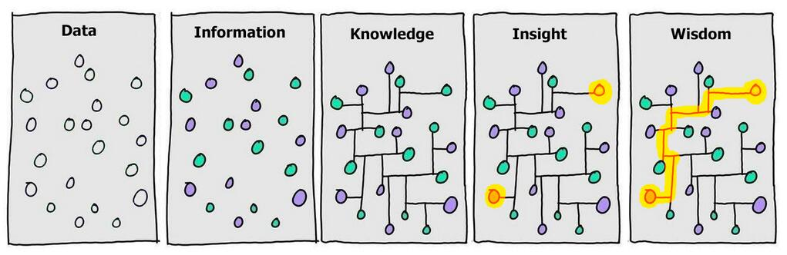
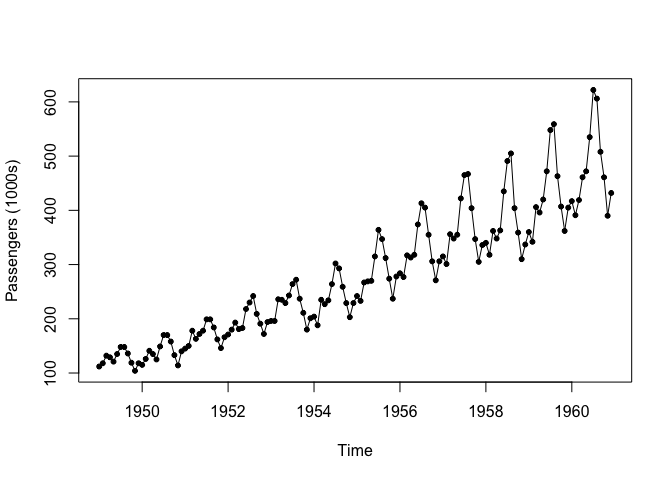
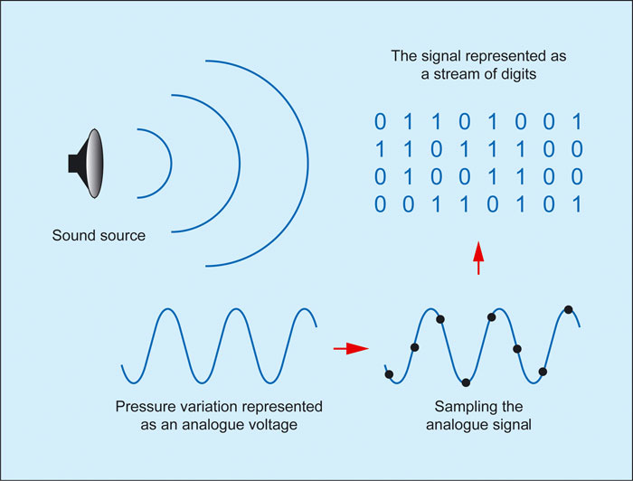
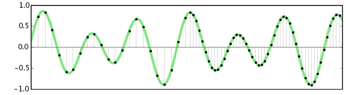
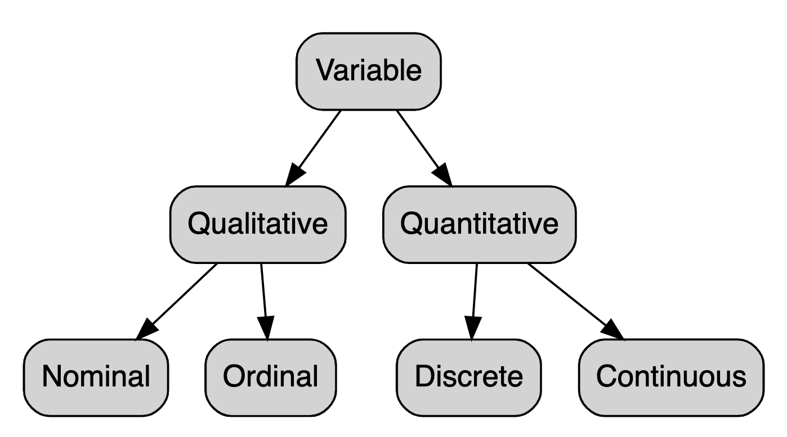

Data
================
Steven Moran
(26 October, 2022)

-   <a href="#what-is-data" id="toc-what-is-data">What is data?</a>
-   <a href="#where-do-i-find-data" id="toc-where-do-i-find-data">Where do I
    find data?</a>
-   <a href="#structured-versus-unstructured-data"
    id="toc-structured-versus-unstructured-data">Structured versus
    unstructured data</a>
-   <a href="#data-formats" id="toc-data-formats">Data formats</a>
    -   <a href="#analog-versus-digital" id="toc-analog-versus-digital">Analog
        versus digital</a>
    -   <a href="#binary-and-electronic-text"
        id="toc-binary-and-electronic-text">Binary and electronic text</a>
-   <a href="#data-types-in-computer-programming"
    id="toc-data-types-in-computer-programming">Data types in computer
    programming</a>
-   <a href="#data-types-in-statistics"
    id="toc-data-types-in-statistics">Data types in statistics</a>
    -   <a href="#qualitative-versus-quantitative-variables"
        id="toc-qualitative-versus-quantitative-variables">Qualitative versus
        quantitative variables</a>
    -   <a href="#scales-of-measurement" id="toc-scales-of-measurement">Scales
        of measurement</a>
-   <a href="#data-structures" id="toc-data-structures">Data structures</a>
-   <a href="#file-formats" id="toc-file-formats">File formats</a>
-   <a href="#tabular-data" id="toc-tabular-data">Tabular data</a>
-   <a href="#metadata" id="toc-metadata">Metadata</a>
-   <a href="#data-archiving" id="toc-data-archiving">Data archiving</a>
-   <a href="#exercises" id="toc-exercises">Exercises</a>
-   <a href="#references-and-footnotes"
    id="toc-references-and-footnotes">References and footnotes</a>

This report uses the [R programming
language](https://cran.r-project.org/doc/FAQ/R-FAQ.html) (R Core Team
2021) and the following [R libraries](https://r-pkgs.org/intro.html)
(Wickham et al. 2019; Xie 2021).

``` r
library(dplyr)
library(knitr)
```

# What is data?

<!-- If you are looking at the source code (good on you!), then here is how one does a comment in Rmd. It's the same format as an HTML comment, i.e., between ASCII looking arrows. -->

[Data](https://en.wikipedia.org/wiki/Data) is everywhere. Data are
“**facts and statistics collected together for reference or analysis**”.
Data is singular *and* plural.[^1]

The noun “data” [comes from the
1640s](https://www.etymonline.com/word/data) and is derived from Latin
*datum*, meaning “something that is given”:

> > > “1640s,”a fact given or granted,” classical plural of datum, from
> > > Latin datum “(thing) given,” neuter past participle of dare “to
> > > give” (from PIE root \*do- “to give”). In classical use originally
> > > “a fact given as the basis for calculation in mathematical
> > > problems.” From 1897 as “numerical facts collected for future
> > > reference.””

It’s more recent meaning with regard to computing is from the 1940s:

> > > “Meaning”transmittable and storable information by which computer
> > > operations are performed” is first recorded 1946. Data-processing
> > > is from 1954; data-base (also database) “structured collection of
> > > data in a computer” is by 1962; data-entry is by 1970.”

[Data](https://en.wikipedia.org/wiki/Data) is different than
information. Data are raw and unorganized facts.

[Information](https://www.etymonline.com/word/information) is that has
been processed, structured, organized, and/or presented within a contact
that make the raw data useful and interpretable. Having context about
data, i.e., information, can help us make decisions, inferences about
the data, etc.

-   <https://www.diffen.com/difference/Data_vs_Information>

| Data                                         | Information                                              |
|----------------------------------------------|----------------------------------------------------------|
| Raw facts, statistics                        | Processed data, organized                                |
| No context, unorganized                      | Data with context to facts, statistics                   |
| Numbers, text, etc. with no inherent meaning | Value-added data (e.g., summarized, organized, analyzed) |

Or
[visually](https://twitter.com/beco/status/717112009385357316/photo/1):



Or in code using the built in [Airline passengers
dataset](https://stat.ethz.ch/R-manual/R-devel/library/datasets/html/AirPassengers.html).
For an overview of the data, you can use the `help()` function:

``` r
help(AirPassengers)
```

To have a look at the first few data points, try the `head()` function:

``` r
head(AirPassengers)
```

    ## [1] 112 118 132 129 121 135

Alternatively, the `tail()` function will show you the last few data
points:

``` r
tail(AirPassengers)
```

    ## [1] 622 606 508 461 390 432

And you can use the `str()` “structure” method to look at the internal
contents of any dataset in R, e.g.:

``` r
str(AirPassengers)
```

    ##  Time-Series [1:144] from 1949 to 1961: 112 118 132 129 121 135 148 148 136 119 ...

Now let’s create some
[information](https://www.etymonline.com/word/information) derived from
the [AirPassengers dataset](https://rpubs.com/emb90/137525) by plotting
the raw data with labeled axes:

``` r
plot(AirPassengers, ylab = "Passengers (1000s)", type = "o", pch = 20)
```

<!-- -->

What does the plot tell us about the raw data?

------------------------------------------------------------------------

Here are some more examples. Is each *data* or *information*?

1.  a student’s test score
2.  average score of the class
3.  2000
4.  2000 Neuchatel
5.  \$2000 monthly income
6.  Satellite image data
7.  Meteorological data
8.  Weather forecasts
9.  Average annual temperature in Neuchatel
10. Daily temperature in Neuchatel

------------------------------------------------------------------------

To summarize, [data](https://en.wikipedia.org/wiki/Data) contain(s) raw
facts, typically without context, and may include numbers, images,
words, text, etc.

[Information](https://www.etymonline.com/word/information) is data
within a context, e.g., processed data, with some value added to the
data, e.g., it’s organized, summarized, or analyzed.

Data is based on observations or records. Information is based on the
organization, summarization, or analysis of the data and tells us
something about the raw data.

# Where do I find data?

The world is awash in data. And the amount of data being created is
increasingly rapidly. By some estimates, there was 60 or more
[zettabytes](https://en.wikipedia.org/wiki/Zettabyte_Era) of data as of
2020.

-   <https://www.statista.com/statistics/871513/worldwide-data-created/>
-   <https://seedscientific.com/how-much-data-is-created-every-day/>
-   <https://rivery.io/blog/big-data-statistics-how-much-data-is-there-in-the-world/>

As of 2021, calculations of how much data is being created stood at:

> > > Each day on Earth we generate 500 million tweets, 294 billion
> > > emails, 4 million gigabytes of Facebook data, 65 billion WhatsApp
> > > messages and 720,000 hours of new content added daily on YouTube.

-   <https://theconversation.com/the-worlds-data-explained-how-much-were-producing-and-where-its-all-stored-159964>

That’s a lot of data. Lots of it’s “closed” or
[“proprietary”](https://en.wikipedia.org/wiki/Proprietary_software)
data. But there’s also lots of [open
data](https://en.wikipedia.org/wiki/Open_data) available.

Try [searching](https://www.google.com/search?q=open+data+sets) for
some!

[Open data](https://en.wikipedia.org/wiki/Open_data) are data that are
freely available and also the idea that data should be freely available.
(Recall what we’ve discussed about data and software licenses.) The idea
is similar to [open source
code](https://en.wikipedia.org/wiki/Open_source), i.e., the idea that
source code is made openly and freely available. Both open data and open
source code are integral to [open data
science](https://en.wikipedia.org/wiki/Open_science_data) and
[reproducible science](https://en.wikipedia.org/wiki/Reproducibility).

There is a lot of openly available datasets out there. Here are some
that I use:

-   <https://archive.ics.uci.edu/ml/index.php>
-   <https://opendata.swiss/en/>
-   <https://zenodo.org>

But don’t be shy – use search to find other places! For example:

-   [best places for open
    datasets](https://www.google.com/search?q=best+places+for+open+datasets)

There are lots of results highlighing where to look for free datasets,
e.g.:

-   <https://careerfoundry.com/en/blog/data-analytics/where-to-find-free-datasets/>
-   <https://www.freecodecamp.org/news/https-medium-freecodecamp-org-best-free-open-data-sources-anyone-can-use-a65b514b0f2d/>

Google for example has a dataset search and a public data portal:

-   <https://datasetsearch.research.google.com>
-   <https://www.google.com/publicdata/directory>

Kaggle is another popular place to look for data:

-   <https://www.kaggle.com/datasets>

Amazon Web Services has a data portal:

-   <https://registry.opendata.aws>

Governments sometimes publish data, e.g.:

-   [European Union](https://data.europa.eu)
-   [US government open data](https://data.gov)
-   [Germany government open data](https://www.govdata.de)
-   [CIA world factbook](https://www.cia.gov/the-world-factbook/)
-   [US census data](https://www.census.gov/data.html)

How about some “high quality data and datasets organized by topic”?

-   <https://datahub.io/collections>

This is an example of a general repository for datasets, which also
includes the UCI Machine Learning Repository:

-   <https://archive.ics.uci.edu/ml/index.php>
-   <https://archive.ics.uci.edu/ml/datasets.php>

Want some data about the Earth?

-   <https://www.earthdata.nasa.gov>

Or particle physics?

-   <http://opendata.cern.ch>

Are you interested in global health?

-   <https://apps.who.int/gho/data/node.home>
-   <https://data.unicef.org>

Or film?

-   <https://www.bfi.org.uk/industry-data-insights>
-   <https://data.world/datasets/movies>
-   <https://www.kaggle.com/datasets/rounakbanik/the-movies-dataset>

Or something more specific? New York city taxis?

-   <https://www1.nyc.gov/site/tlc/about/tlc-trip-record-data.page>

Crime?

-   <https://crime-data-explorer.fr.cloud.gov/pages/home>

Finance?

-   <https://data.worldbank.org>

Are you interested in [data
journalism](https://en.wikipedia.org/wiki/Data_journalism)? Try
FiveThirtyEight or The Pudding:

-   <https://data.fivethirtyeight.com>
-   <https://pudding.cool>

[DBpedia](https://en.wikipedia.org/wiki/DBpedia) is a knowledge base
built on [Wikipedia](https://en.wikipedia.org/wiki/Wikipedia):

-   <https://www.dbpedia.org>

Yelp datasets:

-   <https://www.yelp.com/dataset>

R also has built in datasets:

-   <https://stat.ethz.ch/R-manual/R-devel/library/datasets/html/00Index.html>

# Structured versus unstructured data

[Raw data](https://en.wikipedia.org/wiki/Raw_data) (aka “primary” data)
are data collected from some source. Raw data has not yet been processed
for use. Human brains are very good at processing raw data and making
decisions.

Consider crossing a street – your brain processes the data around you,
from your eyes and/or your ears, together with your working memory, to
make an informed decision of whether crossing the street is safe or not.

[Information](https://www.etymonline.com/word/information) is the end
product of [data
processing](https://en.wikipedia.org/wiki/Data_processing). Data
processing may include:

-   [Validation](https://en.wikipedia.org/wiki/Data_validation) –
    Ensuring that supplied data is correct and relevant.
-   [Sorting](https://en.wikipedia.org/wiki/Sorting) – “arranging items
    in some sequence and/or in different sets.”
-   [Summarization](https://en.wikipedia.org/wiki/Summary_statistics)
    statistical or automatic – reducing detailed data to its main
    points, e.g., taking the mean of a set of numbers.
-   [Aggregation](https://en.wikipedia.org/wiki/Aggregate_data) –
    combining multiple pieces of data.
-   [Analysis](https://en.wikipedia.org/wiki/Statistical_inference) –
    the “collection, organization, analysis, interpretation and
    presentation of data.”
-   [Reporting](https://en.wikipedia.org/wiki/Business_reporting) – list
    detail or summary data or computed information.
-   [Classification](https://en.wikipedia.org/wiki/Data_classification_(business_intelligence))
    – separation of data into various categories.

We can process raw data to turn it into useful information.

Raw data can come in structured or unstructured formats:

-   <https://www.ibm.com/cloud/blog/structured-vs-unstructured-data>

Unstructured data does not have a predefined format and may be (very)
diverse. It is considered qualitative and may be difficult to search,
sort, analyze.

Structured data is data that are organized into a data format and are
quantitative in nature, e.g., tables or relational databases.

What do you think? Structured or unstructured?

1.  text files
2.  emails
3.  audio files
4.  videos
5.  dates
6.  numbers
7.  credit card numbers
8.  phone numbers

Structured or unstructured?

| Date        |
|-------------|
| Jan 1, 2021 |
| 10/10/2010  |
| 22/11/2011  |

Structured or unstructured?

| Date       |
|------------|
| 1/1/2021   |
| 10/10/2010 |
| 22/11/2011 |

For the uninitiated, the terminology in data science (and about data in
general) may seem all over the place. Let’s clarify a few standard terms
that use the word data in the next few sections.

**Most pertinent to this class is the discussion on tabular data
below.**

# Data formats

## Analog versus digital

The data that we work with is mainly [digital
data](https://en.wikipedia.org/wiki/Digital_data).

If for example, we record audio data, e.g., someone’s voice, then a
continuous (analog) signal is converted from [analog to
digital](https://en.wikipedia.org/wiki/Analog-to-digital_converter). In
other words, the audio signal is digitized – meaning that the
disturbances of air waves created by an instrument or speaker is sampled
and digitized and stored into an electronic (aka digital) format.

Consider for example the follow images.
[Sound](https://en.wikipedia.org/wiki/Sound) propagates as an acoustic
wave, i.e., a vibration. The reception of these waves by the human ear
is perceived as sound (only sounds between around 20 Hz and 20 kHz).

-   <https://www.soundonsound.com/techniques/digital-myth>



The sound source is a
[continuous](https://en.wikipedia.org/wiki/Discrete_time_and_continuous_time)
wave is [analog signal](https://en.wikipedia.org/wiki/Analog_signal).

In contrast, a [digital
signal](https://en.wikipedia.org/wiki/Digital_signal) is a sampling of
sequences of the continuous analog wave. See also [analog versus
digital](https://www.adorama.com/alc/analog-vs-digital-audio/) for more
information.

Here is a visualization of [sampling a wave
form](https://manual.audacityteam.org/man/digital_audio.html):


Increasing the sampling rate leads to higher resolution of the audio
(right hand side):



## Binary and electronic text

At the “lowest” level, all digital data is [binary
data](https://en.wikipedia.org/wiki/Binary_data) – see the “stream of
digits” in the figure above.

What is binary? Consider the joke:

[There are 10 types of people in this world… those who understand binary
and those who
don’t.](https://www.urbandictionary.com/define.php?term=there%20are%2010%20types%20of%20people%20in%20this%20world%2C%20those%20who%20understand%20binary%20and%20those%20who%20dont)

Why do we need binary?

At the level that computers function, binary encodes everything – all
electronic text, audio files, video files, etc. (Note there is a
difference between different **file formats** – see section below – and
how those files are digitally encoded.)

In this course we will be focused on [plain
text](https://en.wikipedia.org/wiki/Plain_text) encodings and file
formats (unless for example you read data directly from a program like
Excel). Because all electronic (aka digital) text is encoded at the
“lowest” level in binary, there are ways of turning binary into plain
text:

-   <https://en.wikipedia.org/wiki/Binary-to-text_encoding>

In other words, an electronic text in binary can be encoded as
[printable
characters](https://en.wikipedia.org/wiki/Character_(computing)). What
you see and read on the screen includes characters.

Which of these files are plain text and which are binary? How do you
find out?

-   <https://drive.google.com/drive/folders/1bRg1MS0iBPvb7Rz3eMaezC_PsaKNoFjF?usp=sharing>

Characters are encoded in various [character
encodings](https://en.wikipedia.org/wiki/Character_encoding) – that is,
a character encoding encodes text in computers. Most common character
encodings are based on [ASCII](https://en.wikipedia.org/wiki/ASCII). An
ASCII table:

<https://en.wikipedia.org/wiki/ASCII#ASCII_printable_characters>

The point is that each character is encoded in binary and the computer
knows how to interpret, for example `01100110` and display `f`. Here is
a table that shows the mappings between binary and ASCII characters:

-   <http://sticksandstones.kstrom.com/appen.html>

Nowadays, most of the world uses the [Unicode
Standard](https://en.wikipedia.org/wiki/Unicode) for character encoding
of text. The Unicode Standard builds on ASCII and aims to encode all
writing systems of the world. More recently, its developers aim to make
sure that “everyone in the world should be able to use their own
language on phones and computers”:

-   <https://home.unicode.org>

This includes of course encoding characters for
[emojis](https://en.wikipedia.org/wiki/Emoji)! (Both emoji and emojis
are appropriate plural forms – like data!) According to
[Unicode](https://home.unicode.org/emoji/about-emoji/):

> > > “92% of the world’s online population use emoji in their
> > > communications – and Unicode defines the characters that make
> > > those human connections possible. These 3,600+ emoji represent
> > > faces, weather, vehicles and buildings, food and drink, animals,
> > > and more. From a technical perspective, inside the computer or
> > > phone, each is a sequence of one or more Unicode characters, but
> > > to the billions of users using emoji each day, they can express
> > > love, congratulations, ideas, culture, and much more.”

The [Unicode Consortium](https://unicode.org/consortium/consort.html)
solicits proposals from the public (and from corporations) for adding
new [scripts](https://en.wikipedia.org/wiki/Writing_system) and new
emojis. Maybe you should make a formal request for an emoji that you
would like to see?

Now if are like me, you’re asking yourself how does one puts an emoji
into R markdown? I’m guess I’m not alone:

-   <https://twitter.com/hadleywickham/status/856938704748896258?lang=en>

And there’s apparently an R package for that!

-   <https://github.com/hadley/emo>

First you need to install the [devtools](https://devtools.r-lib.org)
package (first line below) – commented out so that it does not run
*every time* I compile this R Markdown file. The devtools package allows
you to install [R
packages](https://en.wikipedia.org/wiki/R_(programming_language)#Packages)
from third parties, e.g., from someones GitHub repository. That’s line
two below (also commented out because you only need to install it once).
The third line uses the command `emo::ji` and the parameter (or
argument) within ()’s and the value you’re passing as the parameter,
i.e., “poop”. This function then renders the [pile of poo
emoji](https://en.wikipedia.org/wiki/Pile_of_Poo_emoji), aka “poomoji”,
“poop emoji”, which in binary is: 11110000 10011111 10010010 10101001.

``` r
# install.packages("devtools")  # line 1
devtools::install_github("hadley/emo")  # line 2
```

    ## Skipping install of 'emo' from a github remote, the SHA1 (3f03b114) has not changed since last install.
    ##   Use `force = TRUE` to force installation

``` r
emo::ji("poop")  # line 3
```

    ## 💩

Here’s a Unicode table website to easily search for characters and
emojis:

-   <https://unicode-table.com/en/>

Find the craziest Unicode symbol!

# Data types in computer programming

[Data types](https://en.wikipedia.org/wiki/Data_type) for computer
programming typically refer to various *types* of data that can be
interpreted by the computer’s
[compiler](https://en.wikipedia.org/wiki/Compiler). In programming
languages, these include types such as:

-   [Integers](https://en.wikipedia.org/wiki/Integer_(computer_science))
-   [Floats (floating point
    numbers)](https://en.wikipedia.org/wiki/Floating-point_arithmetic)
-   [Characters](https://en.wikipedia.org/wiki/Character_(computing)) –
    ask me about these
-   [Strings](https://en.wikipedia.org/wiki/String_(computer_science)) –
    sequence of characters
-   [Boolean](https://en.wikipedia.org/wiki/Boolean_data_type) – two
    possible values (True vs False)
-   [Enumerated types](https://en.wikipedia.org/wiki/Enumerated_type) –
    categorical data, i.e., a set of values (e.g., factors in R)

In a [typed programming
language](https://en.wikipedia.org/wiki/Type_system), the data type
provides information for the compiler to check the [correctness of the
computer
program](https://en.wikipedia.org/wiki/Correctness_(computer_science)).

R has several data types underlying its data structures, e.g.:

-   <https://www.r-bloggers.com/2021/09/r-data-types/>
-   <https://www.w3schools.com/r/r_data_types.asp>
-   <https://statsandr.com/blog/data-types-in-r/>

[Data types for computer
programming](https://en.wikipedia.org/wiki/Data_type) have comparable
types of [data types in
statistics](https://en.wikipedia.org/wiki/Statistical_data_type) – or
how else would we use computer programs to do statistics? For example:

| Programming                                                                                                             | Statistics                                                                                                                                                          |
|-------------------------------------------------------------------------------------------------------------------------|---------------------------------------------------------------------------------------------------------------------------------------------------------------------|
| [Integer](https://en.wikipedia.org/wiki/Integer_(computer_science))                                                     | [Count data](https://en.wikipedia.org/wiki/Count_data)                                                                                                              |
| [Boolean](https://en.wikipedia.org/wiki/Boolean_data_type)                                                              | [Binary data](https://en.wikipedia.org/wiki/Binary_data)                                                                                                            |
| [Floating-point](https://en.wikipedia.org/wiki/Floating-point_arithmetic)                                               | [Interval scale](https://en.wikipedia.org/wiki/Level_of_measurement#Interval_scale), [Ratio scale](https://en.wikipedia.org/wiki/Positive_real_numbers#Ratio_scale) |
| [Enumerated type](https://en.wikipedia.org/wiki/Enumerated_type)                                                        | [Categorical variable](https://en.wikipedia.org/wiki/Categorical_variable)                                                                                          |
| [List](https://en.wikipedia.org/wiki/List_(abstract_data_type)), [Array](https://en.wikipedia.org/wiki/Array_data_type) | [Random vector](https://en.wikipedia.org/wiki/Multivariate_random_variable)                                                                                         |

Why is important to keep this in mind? How you can programmatically
access, perform functions or statistics on these data types – whether in
programming code or with statistical methods – depends on what **type**
of data you are dealing with. For example:

-   You cannot apply arithmetic to qualitative / categorical values.
-   Ordinal scales are equidistant, so you can rank them, but how much x
    is from y is unknown.

One last distinction to make clear is between the term “variable” in
computer programming and in statistical analysis.

A [variable in computer
programming](https://en.wikipedia.org/wiki/Variable_(computer_science))
is used to store information that can be referenced and manipulated by a
computer program. One assigns a value to a variable, e.g., in R:

``` r
my_name <- 'Steven'
my_name
```

    ## [1] "Steven"

Variables can be manipulated, e.g.:

``` r
my_full_name <- paste0(my_name, ' Moran')
my_full_name
```

    ## [1] "Steven Moran"

Another example:

``` r
x <- 1
y <- 1
x + y
```

    ## [1] 2

# Data types in statistics

## Qualitative versus quantitative variables

In contrast to variables in computer programming, variables in
statistics are **properties** or **characteristics** used to measure a
population of individuals. A variable is thus a quantity whose value can
change across a population.

They include:

-   **Qualitative variables** – measure non-numeric qualities and are
    not subject to the laws of arithmetic.
-   **Quantitative variables** – measure numeric quantities and
    arithmetic can be applied to them.

Qualitative variables are also call **categorical** or **discrete**
variables. Quantitative variables can be measured, so that their rank or
score can tell you about the degree or amount of variable.

A hierarchy of variable types in statistics is given in the image below
taken from this [Stats and R](https://statsandr.com/terms/) blog.



As you can see, variables in statistics can be classified into four
types under qualitative and quantitative variables:

-   **Nominal** – a qualitative variable where no ordering is possible
    (e.g., eye color) as implied by its **levels** – levels can be for
    example binary (e.g., do you smoke?) or multilevel (e.g., what is
    your degree – where each degree is a level).
-   **Ordinal** – a qualitative variable in which an order is implied in
    the levels, e.g., if the side effects of a drug taken are measured
    as “light”, “moderate”, “severe”, then this qualitative ordinal
    value has a clear order or ranking (but note we don’t know *how*
    different these levels are from one to the next!).
-   **Discrete** – variables that can only take specific values (e.g.,
    whole numbers) – no values can exist between these numbers.
-   **Continuous** – variables can take the full range of values (e.g.,
    floating point numbers) – there are an infinite number of potential
    values between values.

Consider these examples:

-   What number were you wearing in the race? – “5”!
-   What place did you finish in? – “5”!
-   How many minutes did it take you to finish? – “5”!

The three “5”s all look the same.

However, the three variables (identification number, finish place, and
time) are quite different. Because of the differences, each “5” has a
different possible interpretation.

What kind of of variables are each of these below?[^2]

``` r
df <- readr::read_csv('variables_quiz.csv', na=character())
knitr::kable(df)
```

| Variable                                            | qualitative | quantitative…3 | quantitative…4 |
|:----------------------------------------------------|:------------|:---------------|:---------------|
|                                                     | discrete    | discrete       | continuous     |
| a\. shoe size (as bought in a store)                |             |                |                |
| b\. price of a salad in a salad bar                 |             |                |                |
| c. vote for a political party                       |             |                |                |
| d. travelling time to a holiday destination         |             |                |                |
| e\. color of eyes                                   |             |                |                |
| f. gender                                           |             |                |                |
| g\. reaction time in a lexical recognition task     |             |                |                |
| h\. customers’ satisfaction on a scale from 1 to 10 |             |                |                |
| i\. number of words in a written sentence           |             |                |                |
| j\. spoken utterance length                         |             |                |                |
| k\. number of goals per player in a football event  |             |                |                |
| l\. body height of a person                         |             |                |                |
| m\. number of vowels in a language                  |             |                |                |

Answers are available [here](variables_quiz_answers.csv).

## Scales of measurement

In statistics, we often talk about [scales of measurement or levels of
measurement](https://en.wikipedia.org/wiki/Level_of_measurement).

When using statistics, one must first understand **what types of
variables** are in question and **what scales** should be measured using
these variables.

The level of measurement of a variable determines what statistical tests
can be applied to it. How a variable is measured is its level of
measurement.

The best-known classification scheme has four levels (Stevens 1946). It
was developed by a psychologist [Stanley Smith
Stevens](https://en.wikipedia.org/wiki/Stanley_Smith_Stevens) and is
commonly used in survey questionnaires, such as the [Likert
scale](https://en.wikipedia.org/wiki/Likert_scale). Each scale above is
an incremental level of measurement, such that each scale incorporates
the function of the previous scale.

-   **Nominal** – the so-called “naming” scale, i.e., variables have
    categorical values with no specific order (thus it’s not really a
    scale at all because it does not scale along any dimension!).
    Instead, the nominal scale is generally used for classification
    purposes, e.g., the numbers worn by athletes.

-   **Ordinal** – the simplest true scale in which variables are encoded
    in a specific order, but the individual positions are equidistant,
    e.g., the rank of winners in a marathon (regardless of their times).

-   **Interval** – a scale of measurement in which the order of the
    variables and the distance between them is known, e.g., a scale for
    temperature (e.g., Celsius or Fahrenheit) in which a difference of
    10 degrees has the same meaning anywhere on the scale (but not
    across scales!).

-   **Ratio** – a scale of measurement that includes rank (ordinal),
    distance between points on the scale (interval) and additionally
    information about the value of \*true zero\*\*, where zero means the
    complete absence of the property under measurement, e.g., how many
    [cervelat](https://en.wikipedia.org/wiki/Cervelat) can you eat per
    day?

Depending on what is being measured (i.e., what kind of variables) and
how we measure it (i.e., with what methods and scales), the numbers or
categories may have different properties.

We will talk about this more in future lectures.

But note that in general it is **rare to find a true and unambiguous
example of any particular kind of scale**.

Consider for example that Stevens’ scale unifies qualitative and
quantitative beneath the “nominal” type. Thus, Stevens’ typology has
been widely criticized, e.g., Michell (1986).

Here is a cheat sheet that summarizes the levels of measurement.[^3]

``` r
df <- readr::read_csv('levels_of_measurement.csv')
knitr::kable(df)
```

| Property                                      | Nominal | Ordinal | Interval | Ratio |
|:----------------------------------------------|:--------|:--------|:---------|:------|
| The sequence of variables is established      | No      | Yes     | Yes      | Yes   |
| Mode                                          | Yes     | Yes     | Yes      | Yes   |
| Median                                        | No      | Yes     | Yes      | Yes   |
| Mean                                          | No      | No      | Yes      | Yes   |
| Difference between variables can be evaluated | No      | No      | Yes      | Yes   |
| Addition and Subtraction of variables         | No      | No      | Yes      | Yes   |
| Multiplication and Division of variables      | No      | No      | No       | Yes   |
| Absolute zero                                 | No      | No      | No       | Yes   |

And here is a table that compares the levels of measurement.

``` r
df <- readr::read_csv('comparison_of_levels.csv')
knitr::kable(df)
```

| Incrementalprogress | Measure property           | Mathematicaloperators | Advancedoperations       | Centraltendency               | Variability                                 |
|:--------------------|:---------------------------|:----------------------|:-------------------------|:------------------------------|:--------------------------------------------|
| Nominal             | Classification, membership | =, ≠                  | Grouping                 | Mode                          | Qualitative variation                       |
| Ordinal             | Comparison, level          | \>, \<                | Sorting                  | Median                        | Range, Interquartile range                  |
| Interval            | Difference, affinity       | +, −                  | Comparison to a standard | Arithmetic mean               | Deviation                                   |
| Ratio               | Magnitude, amount          | ×, /                  | Ratio                    | Geometric mean, Harmonic mean | Coefficient of variation, Studentized range |

And yet another way of looking at the differences between scales (Spatz
2008). <!-- page 11 -->

``` r
df <- readr::read_csv('Spatz2008_11.csv')
knitr::kable(df)
```

| Scale of measurment | Different numbers for different things | Numbers convey greater than and less than | Equal differences mean equal amounts | Zero means none what was measured was detected |
|:--------------------|:---------------------------------------|:------------------------------------------|:-------------------------------------|:-----------------------------------------------|
| Nominal             | Yes                                    | No                                        | No                                   | No                                             |
| Ordinal             | Yes                                    | Yes                                       | No                                   | No                                             |
| Interval            | Yes                                    | Yes                                       | Yes                                  | No                                             |
| Ratio               | Yes                                    | Yes                                       | Yes                                  | Yes                                            |

------------------------------------------------------------------------

To summarize, knowing the distinctions among the four scales of
measurement will help you in two tasks:

-   The kind of descriptive statistics you can compute from numbers
    depends, in part, on the scale of measurement the numbers represent.

-   Understanding scales of measurement is sometimes important in
    choosing the kind of inferential statistic that is appropriate for a
    set of data. For example, if the dependent variable is a nominal
    variable, then a chi-square analysis is appropriate. If the
    dependent variable is a set of ranks (ordinal data), then a
    nonparametric statistic is required. Etc.

# Data structures

[Data structures](https://en.wikipedia.org/wiki/Data_structure) are
collections of data values that are organized so that operations can be
performed on them. They include the primitive data types (some mentioned
above) but also abstract data types, linear data structures, trees,
hashes, graphs, and so on.

-   <https://en.wikipedia.org/wiki/List_of_data_structures>

Data structures are also typically programming language dependent, i.e.,
the developers of the language have made decisions which types of data
structures to implement. R has several data structures:

-   <http://adv-r.had.co.nz/Data-structures.html>

[Data transformation](https://en.wikipedia.org/wiki/Data_transformation)
is the process of converting one data format to another (whether
unstructured or structured). This is discussed under data wrangling.

# File formats

[File formants](https://en.wikipedia.org/wiki/File_format) are
standardized ways of encoding digital data for storage as computer
files. You know these mainly from their appearance, e.g., text document,
image, audio or video file. But also from their [filename
extensions](https://en.wikipedia.org/wiki/Filename_extension), i.e., the
suffix (typically) after “.” in the file name. For example, this file is
a markdown file that ends in “.md” (or a R Markdown file “.Rmd” if you
are looking at the source code).

Typical file names include suffixes such as:

-   .txt – [plain text file](https://en.wikipedia.org/wiki/Plain_text)
-   .csv – [CSV comma-separated
    values](https://en.wikipedia.org/wiki/Comma-separated_values)
-   .doc – [MS Word doc](https://en.wikipedia.org/wiki/Microsoft_Word)
-   .html – [HTML](https://en.wikipedia.org/wiki/HTML), i.e., the
    [markup language](https://en.wikipedia.org/wiki/Markup_language) for
    documents displayed in a web browser
-   .exe – [executable file](https://en.wikipedia.org/wiki/.exe) for
    [Windows](https://en.wikipedia.org/wiki/Microsoft_Windows)

There are lots more!

A note about textual data – its native format is unstructured, but it
can be structured into other formats, e.g., tabular format, for
processing. Consider the following code snippet.

First, we generate some [Lorem Ipsum](https://www.lipsum.com) text and
assign it to a variable called `text`.

``` r
text <- "Lorem ipsum dolor sit amet, consectetur adipiscing elit. Praesent vitae nisi nibh. In dolor neque, ultricies a tincidunt et, rutrum in erat. Morbi venenatis massa at neque imperdiet, eu faucibus augue varius. Ut molestie risus in dolor porttitor pretium sit amet vel enim. Pellentesque posuere blandit velit eget ultrices. Sed tristique dui ipsum, id sodales dui egestas id. Proin a dolor placerat, accumsan quam nec, ullamcorper enim. Nunc commodo a quam sit amet molestie. Quisque nec elit et diam consequat aliquet nec sed leo. Mauris scelerisque sed lorem eu bibendum. Morbi id ex commodo, elementum elit at, varius dui. Maecenas facilisis velit ut malesuada lobortis. Vestibulum dictum dapibus velit ut pellentesque."
```

Now perhaps we want to have a table of [word
types](https://en.wikipedia.org/wiki/Type–token_distinction) and counts
of their occurrences (i.e., word tokens), so that we can know how many
times they occur in the text.

First we can split the `text` character string into an [R `list` data
type](http://www.r-tutor.com/r-introduction/list). On the second line we
simply display the output from splitting the character string on white
space.

``` r
words <- strsplit(text, " ")
words
```

    ## [[1]]
    ##   [1] "Lorem"         "ipsum"         "dolor"         "sit"          
    ##   [5] "amet,"         "consectetur"   "adipiscing"    "elit."        
    ##   [9] "Praesent"      "vitae"         "nisi"          "nibh."        
    ##  [13] "In"            "dolor"         "neque,"        "ultricies"    
    ##  [17] "a"             "tincidunt"     "et,"           "rutrum"       
    ##  [21] "in"            "erat."         "Morbi"         "venenatis"    
    ##  [25] "massa"         "at"            "neque"         "imperdiet,"   
    ##  [29] "eu"            "faucibus"      "augue"         "varius."      
    ##  [33] "Ut"            "molestie"      "risus"         "in"           
    ##  [37] "dolor"         "porttitor"     "pretium"       "sit"          
    ##  [41] "amet"          "vel"           "enim."         "Pellentesque" 
    ##  [45] "posuere"       "blandit"       "velit"         "eget"         
    ##  [49] "ultrices."     "Sed"           "tristique"     "dui"          
    ##  [53] "ipsum,"        "id"            "sodales"       "dui"          
    ##  [57] "egestas"       "id."           "Proin"         "a"            
    ##  [61] "dolor"         "placerat,"     "accumsan"      "quam"         
    ##  [65] "nec,"          "ullamcorper"   "enim."         "Nunc"         
    ##  [69] "commodo"       "a"             "quam"          "sit"          
    ##  [73] "amet"          "molestie."     "Quisque"       "nec"          
    ##  [77] "elit"          "et"            "diam"          "consequat"    
    ##  [81] "aliquet"       "nec"           "sed"           "leo."         
    ##  [85] "Mauris"        "scelerisque"   "sed"           "lorem"        
    ##  [89] "eu"            "bibendum."     "Morbi"         "id"           
    ##  [93] "ex"            "commodo,"      "elementum"     "elit"         
    ##  [97] "at,"           "varius"        "dui."          "Maecenas"     
    ## [101] "facilisis"     "velit"         "ut"            "malesuada"    
    ## [105] "lobortis."     "Vestibulum"    "dictum"        "dapibus"      
    ## [109] "velit"         "ut"            "pellentesque."

We can then “[coerce](https://en.wikipedia.org/wiki/Data_conversion)”,
i.e., convert, the list of words into an [R data
frame](https://stat.ethz.ch/R-manual/R-devel/library/base/html/data.frame.html)
with the following function (`as.data.frame`), to which we pass it
`words` and tell it to name the column (there’s only one) “words”. We
assign the results to a new data frame `words_df`. We can use the `head`
function on `words_df` to display the first few rows.

``` r
words_df <- as.data.frame(words, col.names = "words")
head(words_df)
```

    ##         words
    ## 1       Lorem
    ## 2       ipsum
    ## 3       dolor
    ## 4         sit
    ## 5       amet,
    ## 6 consectetur

Lastly, we want to summarize the number of times a word occurs.

``` r
words_df %>% 
  group_by(words) %>% 
  summarize(word_count = n()) %>%
  arrange(desc(word_count))
```

    ## # A tibble: 90 × 2
    ##    words word_count
    ##    <chr>      <int>
    ##  1 dolor          4
    ##  2 a              3
    ##  3 sit            3
    ##  4 velit          3
    ##  5 amet           2
    ##  6 dui            2
    ##  7 elit           2
    ##  8 enim.          2
    ##  9 eu             2
    ## 10 id             2
    ## # … with 80 more rows

We can save the results to another data frame or we can write them to
disk as a table for later use, e.g., as a CSV file (more in next
section).

Are the results data or information? Was the text string that we started
with data or information?

# Tabular data

In this course, we are mainly going to be dealing with data in [plain
text](https://en.wikipedia.org/wiki/Plain_text) and structured data in
rectangular format, also known as **tabular data**. Here are some
descriptions:

-   <https://en.wikipedia.org/wiki/Table_(information)>
-   <https://papl.cs.brown.edu/2016/intro-tabular-data.html>
-   <https://www.w3.org/TR/tabular-data-model/>

Tabular data **can be stored in many ways**, e.g.:

-   [CSV](https://en.wikipedia.org/wiki/Comma-separated_values)
-   [Excel sheets](https://en.wikipedia.org/wiki/Microsoft_Excel)
-   [Google sheets](https://en.wikipedia.org/wiki/Google_Sheets)
-   [Numbers](https://en.wikipedia.org/wiki/Numbers_(spreadsheet))
-   [SQLite](https://en.wikipedia.org/wiki/SQLite)
-   [JSON](https://en.wikipedia.org/wiki/JSON)

Which of these formats above are stored in plain text?

------------------------------------------------------------------------

Tabular (or table) data has several properties. It consists of [rows and
columns](https://en.wikipedia.org/wiki/Row_and_column_vectors) in the
linear algebra sense, and
[rows](https://en.wikipedia.org/wiki/Row_(database)) and
[columns](https://en.wikipedia.org/wiki/Column_(database)) in the
relational database sense.

[Columns](https://en.wikipedia.org/wiki/Column_(database)) in tabular
data contain a set of data of a particular type and contain (typically)
one value (data type – see above) for each row in the table.

Each [row](https://en.wikipedia.org/wiki/Row_(database)) in the table
contains an observation, in which each row represents a set of related
data, i.e., every row has the same structure and each cell in each row
should adhere to the column’s specification (i.e., that data type of
that column).

For example if you run the `data()` command in R / RStudio, you will get
a list of all of the pre-loaded data sets available in R.

``` r
# Recall you can also use the help() function to learn more about datasets in R, i.e., run: help(data)
data()
```

For example, do you want to know about the [Swiss Fertility and
Socioeconomic Indicators (1888)
Data](https://stat.ethz.ch/R-manual/R-devel/library/datasets/html/swiss.html)
available in R? This is a dataset with standardized fertility measures
and socio-economic indicators for each of the 47 French-speaking
provinces of Switzerland in 1888.

``` r
help(swiss)
data(swiss)
head(swiss)
```

    ##              Fertility Agriculture Examination Education Catholic
    ## Courtelary        80.2        17.0          15        12     9.96
    ## Delemont          83.1        45.1           6         9    84.84
    ## Franches-Mnt      92.5        39.7           5         5    93.40
    ## Moutier           85.8        36.5          12         7    33.77
    ## Neuveville        76.9        43.5          17        15     5.16
    ## Porrentruy        76.1        35.3           9         7    90.57
    ##              Infant.Mortality
    ## Courtelary               22.2
    ## Delemont                 22.2
    ## Franches-Mnt             20.2
    ## Moutier                  20.3
    ## Neuveville               20.6
    ## Porrentruy               26.6

What are the columns? What their data types? What are the rows? Again,
we can use the structure function `str()` and pass it the dataset’s
name.

``` r
str(swiss)
```

    ## 'data.frame':    47 obs. of  6 variables:
    ##  $ Fertility       : num  80.2 83.1 92.5 85.8 76.9 76.1 83.8 92.4 82.4 82.9 ...
    ##  $ Agriculture     : num  17 45.1 39.7 36.5 43.5 35.3 70.2 67.8 53.3 45.2 ...
    ##  $ Examination     : int  15 6 5 12 17 9 16 14 12 16 ...
    ##  $ Education       : int  12 9 5 7 15 7 7 8 7 13 ...
    ##  $ Catholic        : num  9.96 84.84 93.4 33.77 5.16 ...
    ##  $ Infant.Mortality: num  22.2 22.2 20.2 20.3 20.6 26.6 23.6 24.9 21 24.4 ...

------------------------------------------------------------------------

When there is more than one table and they are are specified relations
between the tables, then you have a [relational
database](https://en.wikipedia.org/wiki/Relational_database). We will
discuss these later.

Lastly, note that there are lots of non-rectangular (i.e., not tabular)
datasets out there. Some examples include text, images, audio files,
video files, [tree data
structures](https://en.wikipedia.org/wiki/Tree_(data_structure)), and so
on.

**We will focus in this course on tabular data – that is, loading it,
transforming it, creating it, and analyzing it.**

Tabular data typically contains numerical data or [categorical
data](https://en.wikipedia.org/wiki/Categorical_variable) (recall data
types discussed above). Numerical data is either:

-   numerical (aka discrete) – integer values, e.g., counts, indices.
-   continuous – data that can take any value within in interval, e.g.,
    temperature.

[Categorical data](https://en.wikipedia.org/wiki/Categorical_variable)
represents sets of values that represent possible categories. They are
not subject to the laws of arithmetic (but note they can be counted, as
are the words in the example above). Categorical data includes:

-   binary – dichotomous data, i.e., True vs False (often encoded 1
    vs. 0).
-   ordinal – categorical data with explicit ordering, e.g., grades,
    ranks, 5-star reviews.

The types of data in your table, i.e., the [statistical data
types](https://en.wikipedia.org/wiki/Statistical_data_type) **constrain
or determine the types of statistics you can do with your data!**

# Metadata

A quick note about metadata.
[Metadata](https://en.wikipedia.org/wiki/Metadata) is data about data,
i.e., it provides information about the data. There are different
metadata types, but most pertinent to this course are:

-   **Descriptive metadata** -— the descriptive information about a
    resource. It is used for discovery and identification. It includes
    elements such as title, abstract, author, and keywords.

-   **Structural metadata** -— metadata about containers of data and
    indicates how compound objects are put together, for example, how
    pages are ordered to form chapters. It describes the types,
    versions, relationships and other characteristics of digital
    materials.

# Data archiving

We won’t talk much about data archiving, but it is important for
research and reproducibility, e.g.:

-   <https://en.wikipedia.org/wiki/Research_data_archiving>

Ask me more, if you have questions or it is relevant to your research!
For example, I have collected a lot of data on endangered languages,
which I digitally archive in an attempt to preserve it for future
speakers and researchers.

# Exercises

Understanding data types is important for data visualization and
statistical modeling. Check out the case studies on [data behind the
plots](../case_studies/data_behind_the_plot/).

# References and footnotes

<div id="refs" class="references csl-bib-body hanging-indent">

<div id="ref-Michell1986" class="csl-entry">

Michell, Joel. 1986. “Measurement Scales and Statistics: A Clash of
Paradigms.” *Psychological Bulletin* 100 (3): 398.

</div>

<div id="ref-R" class="csl-entry">

R Core Team. 2021. *R: A Language and Environment for Statistical
Computing*. Vienna, Austria: R Foundation for Statistical Computing.
<https://www.R-project.org/>.

</div>

<div id="ref-Spatz2008" class="csl-entry">

Spatz, Chris. 2008. *Basic Statistics: Tales of Distributions*. Thomson
Wadsworth.

</div>

<div id="ref-Stevens1946" class="csl-entry">

Stevens, Stanley Smith. 1946. “On the Theory of Scales of Measurement.”
*Science* 103 (2684): 677–80.

</div>

<div id="ref-tidyverse" class="csl-entry">

Wickham, Hadley, Mara Averick, Jennifer Bryan, Winston Chang, Lucy
D’Agostino McGowan, Romain François, Garrett Grolemund, et al. 2019.
“Welcome to the <span class="nocase">tidyverse</span>.” *Journal of Open
Source Software* 4 (43): 1686. <https://doi.org/10.21105/joss.01686>.

</div>

<div id="ref-knitr" class="csl-entry">

Xie, Yihui. 2021. *Knitr: A General-Purpose Package for Dynamic Report
Generation in r*. <https://yihui.org/knitr/>.

</div>

</div>

[^1]: As per the
    [Dictionary.app](https://en.wikipedia.org/wiki/Dictionary_(software)):
    “In Latin, data is the plural of datum and, historically and in
    specialized scientific fields, it is also treated as a plural in
    English, taking a plural verb, as in the data were collected and
    classified. In modern nonscientific use, however, it is generally
    not treated as a plural. Instead, it is treated as a mass noun,
    similar to a word like information, which takes a singular verb.
    Sentences such as data was collected over a number of years are now
    widely accepted in standard English.”

[^2]: Note we set the `na` parameter of `readr::read_csv` to
    `na=character()` so that the blank cells in the CSV file are not
    interpreted as [NA](https://en.wikipedia.org/wiki/N/A), i.e., “not
    applicable”. Note also the “\_1” in the output – ask me about it!)

[^3]: Note also how we load a CSV file in R Markdown and display it in a
    tabular format with `knitr`.
