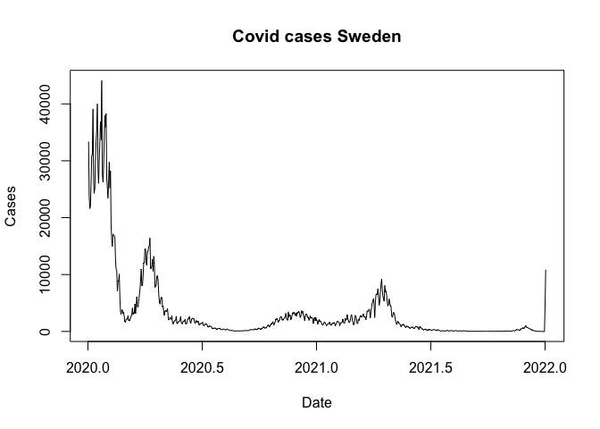

Time series analysis: basics
================
Steven Moran & Marco Maiolini
23 November, 2022

-   <a href="#overview" id="toc-overview">Overview</a>
-   <a href="#case-study-covid-19" id="toc-case-study-covid-19">Case study:
    COVID-19</a>
-   <a href="#case-study-species-in-italy"
    id="toc-case-study-species-in-italy">Case study: Species in Italy</a>
-   <a href="#helpful-hints" id="toc-helpful-hints">Helpful hints</a>
-   <a href="#where-to-find-more-data"
    id="toc-where-to-find-more-data">Where to find more data</a>

# Overview

See the [lecture slides](Time_Series.pdf) and take the DataCamp tutorial
for deeper insights and discussion.

Let’s dive into two case studies using time series analysis. Both
datasets are available in the [data](data/) directory.

# Case study: COVID-19

[COVID-19](https://en.wikipedia.org/wiki/COVID-19) data is publicly
available.

Load the R packages.

``` r
library(tidyverse)
library(tseries)
```

We have some data about COVID-19. Let’s load it.

``` r
data <- read_csv("data/Covid_19_cases_EU.csv")
```

And take a look.

``` r
head(data)
```

    ## # A tibble: 6 × 3
    ##   Date       Cases Countries
    ##   <date>     <dbl> <chr>    
    ## 1 2022-02-22 33374 Austria  
    ## 2 2022-02-21 23783 Austria  
    ## 3 2022-02-20 21601 Austria  
    ## 4 2022-02-19 22058 Austria  
    ## 5 2022-02-18 26153 Austria  
    ## 6 2022-02-17 30888 Austria

``` r
str(data)
```

    ## spec_tbl_df [21,836 × 3] (S3: spec_tbl_df/tbl_df/tbl/data.frame)
    ##  $ Date     : Date[1:21836], format: "2022-02-22" "2022-02-21" ...
    ##  $ Cases    : num [1:21836] 33374 23783 21601 22058 26153 ...
    ##  $ Countries: chr [1:21836] "Austria" "Austria" "Austria" "Austria" ...
    ##  - attr(*, "spec")=
    ##   .. cols(
    ##   ..   Date = col_date(format = ""),
    ##   ..   Cases = col_double(),
    ##   ..   Countries = col_character()
    ##   .. )
    ##  - attr(*, "problems")=<externalptr>

Maybe we want to explore it a bit.

``` r
table(data$Countries)
```

    ## 
    ##       Austria       Belgium      Bulgaria       Croatia        Cyprus 
    ##           728           725           720           729           717 
    ##       Czechia       Denmark       Estonia       Finland        France 
    ##           760           723           730           785           763 
    ##       Germany        Greece       Hungary       Iceland       Ireland 
    ##           750           729           723           569           725 
    ##         Italy        Latvia Liechtenstein     Lithuania    Luxembourg 
    ##           731           726           701           754           730 
    ##         Malta   Netherlands        Norway        Poland      Portugal 
    ##           720           727           737           722           729 
    ##       Romania      Slovakia      Slovenia         Spain        Sweden 
    ##           708           719           721           785           750

``` r
data %>% filter(Countries == "Sweden")
```

    ## # A tibble: 750 × 3
    ##    Date       Cases Countries
    ##    <date>     <dbl> <chr>    
    ##  1 2022-02-22  3189 Sweden   
    ##  2 2022-02-21  2283 Sweden   
    ##  3 2022-02-20  1088 Sweden   
    ##  4 2022-02-19  1970 Sweden   
    ##  5 2022-02-18  3423 Sweden   
    ##  6 2022-02-17  4217 Sweden   
    ##  7 2022-02-16  4049 Sweden   
    ##  8 2022-02-15  4882 Sweden   
    ##  9 2022-02-14  2548 Sweden   
    ## 10 2022-02-13  1177 Sweden   
    ## # … with 740 more rows

Let’s formulate a hypothesis.

-   H0: The covid cases will decrease (not increase)
-   H1: The covid cases will increase

------------------------------------------------------------------------

Although the loaded data is not a time series object in R, the raw data
is time series. Convert the data into time series.

``` r
is.ts(data)
```

    ## [1] FALSE

``` r
class(data)
```

    ## [1] "spec_tbl_df" "tbl_df"      "tbl"         "data.frame"

``` r
data$Date <- as.Date(data$Date)
data$Cases <- as.numeric(data$Cases)
data.ts <- ts(data$Cases, start = c(2020, 2), end = c(2022, 2), frequency = 365)
is.ts(data.ts)
```

    ## [1] TRUE

``` r
print(data.ts)
```

    ## Time Series:
    ## Start = c(2020, 2) 
    ## End = c(2022, 2) 
    ## Frequency = 365 
    ##   [1] 33374 23783 21601 22058 26153 30888 31092 39128 26692 24278 25193 30026
    ##  [13] 33351 35231 39978 28842 26030 30066 33273 36897 33690 44131 27813 26210
    ##  [25] 29051 33712 37974 35889 38280 26766 25258 23441 26738 29751 25197 28187
    ##  [37] 18365 16189 14957 17117 16990 16873 16548 12698 10938 10720  7059  8897
    ##  [49]  8795 10086  5998  3490  3004  3706  3809  3181  3344  2606  1735  1634
    ##  [61]  2117  2264  2163  2816  1950  1887  1989  2348  2699  2934  4133  2935
    ##  [73]  3265  3271  4825  3126  4318  6089  4428  4271  5315  6267  7267  8774
    ##  [85] 10965  8108  7988  9622 12055 12126 14464 14515 11979 11642 14106 14075
    ##  [97] 14892 15028 16474 10979 11206 11439 12662 10591 13223 11976  7760  8023
    ## [109]  8128  9708  9785  8969  6583  5287  4797  5634  5981  5939  4312  4488
    ## [121]  3445  2797  3534  3709  3485  3620  3981  2726  1997  2151  2381  2393
    ## [133]  2115  2722  1594  1297  1583  1877  1851  2037  2680  1458  1374  1558
    ## [145]  1808  1739  1925  2615  1589  1383  1386  1827  1816  1841  2108  1378
    ## [157]  1337  1429  2028  2211  2317  2600  1848  1390  1834  2245  2338  2168
    ## [169]  2301  1799  1390  1577  1931  1692  1557  1852  1281  1083  1345  1374
    ## [181]  1403  1452  1618  1155   983  1106  1286  1312  1291  1213   875   796
    ## [193]   833   951   968   859   874   617   436   563   571   600   497   595
    ## [205]   403   346   420   544   531   506   547   365   316   325   342   421
    ## [217]   419   363   336   265   336   430   353   301   273   245   184   154
    ## [229]   178   199   148   127   103    73    68   104   108    80   106    93
    ## [241]    73    66   117   108    99   116   102   115   108   149   131   171
    ## [253]   180   147   103   207   198   227   287   356   308   311   326   284
    ## [265]   351   305   489   360   327   385   423   537   607   485   407   349
    ## [277]   509   569   661   610   845   639   521   684   636   852   997  1158
    ## [289]   928   745  1062  1155  1385  1394  1726  1448  1109  1540  1667  2118
    ## [301]  2157  2272  1917  1592  1898  1972  2484  2618  2531  2091  2015  2033
    ## [313]  2366  2355  2738  3179  2242  2059  1965  3459  2509  2871  2850  2009
    ## [325]  2332  2818  3307  3093  3394  3136  2797  3232  2647  3303  3216  3447
    ## [337]  3540  3021  2439  2690  3650  3222  3520  2871  2759  1908  2525  3033
    ## [349]  3055  2871  2412  2523  1947  2246  2763  2350  2400  2452  2192  1401
    ## [361]  2224  2496  1889  2445  1967  1889  1225  1657  2092  1708  1900  1657
    ## [373]  1499  1168  1171  1268  1562  1668  1470  1232   999  1146  1365  1270
    ## [385]  1520  1643  1217  1134  1099  1487  1422  1472  1585  1425   947  1262
    ## [397]  1453  1789  1741  1657  1632  1010  1320  1557  1536  1656  2160  1706
    ## [409]  1388  1547  2298  2000  2086  2961  2292  1895  1635  1591  2003  2712
    ## [421]  2974  2125  1697  1163  1287  1807  2854  2557  2107  1353  1505  2151
    ## [433]  1950  2389  2757  2742  2505  2636  2836  3090  2481  2631  2512  2067
    ## [445]  2866  3591  3657  3570  3935  3374  2391  3738  4237  5017  5391  5743
    ## [457]  4607  2437  5153  6464  6608  6434  7523  6075  4611  5100  7017  8259
    ## [469]  9177  7434  6249  5743  5323  8090  6953  7109  6360  5192  4479  4790
    ## [481]  5716  5047  4468  4374  2781  2475  2969  3348  3230  2655  1978  1646
    ## [493]  1199  1485  1795  1522  1435  1322  1142   830  1014  1260  1109  1274
    ## [505]  1078   927   737   718  1014   791   853   759   739   545   591   763
    ## [517]   657   804   719   582   471   667   874   806   854   723   820   414
    ## [529]   415   930   598   691   552   396   367   217   380   366   429   286
    ## [541]   222   223   237   394   226   319   301   243   193   229   302   331
    ## [553]   347   252   259   169   156   349   251   190   187   158    72   104
    ## [565]    90   119   159    83    93    70    62   123   190   102   153    96
    ## [577]   101   112   153   117   162   137    90    87    81   124   141   130
    ## [589]   123    98    52    90   105    72   117    91    69    76   106   134
    ## [601]    80    95   101    49    63    45    74    44    35    43    31    29
    ## [613]    32    52    32    31    19    53    18    22    37    22    34    15
    ## [625]    24    25    31    67    17    53    16    19     5    32    42    19
    ## [637]    50    22    25    31    24    28    31    30    61    58    26    15
    ## [649]    81    54    52    38    66    15    30    50    38    46    54    30
    ## [661]    12    28    37    54    61    49    70    35    62    79    60    73
    ## [673]    70    68    47    60   100   111   129   150    87   111   203   357
    ## [685]   276   290   289   306   183   253   411   438   549   551   671   547
    ## [697]   617   807  1057   754   723   687   618   548   509   455   372   346
    ## [709]   226   198   210   182    98   109    55    22    28    23    29     9
    ## [721]    14     6     5     4     1     4     2     1     7  4646 10863

``` r
str(data.ts)
```

    ##  Time-Series [1:731] from 2020 to 2022: 33374 23783 21601 22058 26153 ...

``` r
start(data.ts)
```

    ## [1] 2020    2

``` r
end(data.ts)
```

    ## [1] 2022    2

``` r
frequency(data.ts)
```

    ## [1] 365

``` r
deltat(data.ts)
```

    ## [1] 0.002739726

Visualize it as a time-series.

``` r
# par (mfrow=c(2,1), mar=c(4,4,4,4))
ts.plot(data.ts, col = 1:4, xlab = "Date", ylab = "Cases", main = "Covid cases Sweden", type = "l")
```

<!-- -->

ACF plot.

``` r
acf(data.ts, main = "acf plot of Covid cases in Sweden")
```

<!-- -->

Which model is more suitable?

``` r
data_diff <- diff(data.ts)

par(mfrow=c(1,1), mar=c(4,4,4,4))

ts.plot(data_diff, xlab = "Date", ylab = "Cases", main = "WN Covid cases --", type = "l")
```

<!-- -->

``` r
arima(x= data.ts, order = c(0,0,0)) # Fit WN model
```

    ## 
    ## Call:
    ## arima(x = data.ts, order = c(0, 0, 0))
    ## 
    ## Coefficients:
    ##       intercept
    ##       3533.1601
    ## s.e.   255.4046
    ## 
    ## sigma^2 estimated as 47683719:  log likelihood = -7499.32,  aic = 15002.64

``` r
arima(x= data.ts , order = c(0,1,0))  # Fit RW model
```

    ## 
    ## Call:
    ## arima(x = data.ts, order = c(0, 1, 0))
    ## 
    ## 
    ## sigma^2 estimated as 2327483:  log likelihood = -6386.83,  aic = 12775.67

``` r
data_AR <- arima(data.ts, order = c(1,0,0))
print(data_AR)
```

    ## 
    ## Call:
    ## arima(x = data.ts, order = c(1, 0, 0))
    ## 
    ## Coefficients:
    ##          ar1  intercept
    ##       0.9856   5547.916
    ## s.e.  0.0074   3618.427
    ## 
    ## sigma^2 estimated as 2317134:  log likelihood = -6395.73,  aic = 12797.46

``` r
ts.plot(data.ts, xlab = "Date", ylab = "Cases", main = "AR Covid cases ---", type = "l")
AR_fitted <- data.ts - residuals(data_AR)
points(AR_fitted, type = "l", col = 2, lty = 2)
```

<!-- -->

``` r
data_MA <- arima(data.ts, order = c(0,0,1))
print(data_AR)
```

    ## 
    ## Call:
    ## arima(x = data.ts, order = c(1, 0, 0))
    ## 
    ## Coefficients:
    ##          ar1  intercept
    ##       0.9856   5547.916
    ## s.e.  0.0074   3618.427
    ## 
    ## sigma^2 estimated as 2317134:  log likelihood = -6395.73,  aic = 12797.46

``` r
ts.plot(data.ts, xlab = "Date", ylab = "Cases", main = "MA Covid cases ---", type = "l")
MA_fitted <- data.ts - residuals((data_MA))
points(MA_fitted, type = "l", col = 2, lty = 2)
```

<!-- -->

Let’s forecast the time series trends.

``` r
ts.plot(data.ts, xlab = "Date", ylab = "Cases", main = "Prediction Covid cases ---", type = "l")
AR_forecast <- predict(data_AR, n.ahead = 10)$pred
AR_forecast_se <- predict(data_AR, n.ahead = 10)$se
points(AR_forecast, type = "l", col = 2)
points(AR_forecast - 2*AR_forecast_se, type = "l", col = 2, lty = 2)
points(AR_forecast + 2*AR_forecast_se,type = "l", col = 2, lty = 2)
```

<!-- -->

``` r
ts.plot(data.ts, xlab = "Date", ylab = "Cases", main = "Prediction Covid cases ---", type = "l")
MA_forecast <- predict(data_MA, n.ahead = 10)$pred
MA_forecast_se <- predict(data_MA, n.ahead = 10)$se
points(MA_forecast, type = "l", col = 2)
points(MA_forecast - 2*MA_forecast_se, type = "l", col = 2, lty = 2)
points(MA_forecast + 2*MA_forecast_se,type = "l", col = 2, lty = 2)
```

<!-- -->

Which model is better?

``` r
cor(AR_fitted, MA_fitted)
```

    ## [1] 0.9322623

Autoregression.

``` r
AIC(data_AR) # Better
```

    ## [1] 12797.46

``` r
BIC(data_AR)
```

    ## [1] 12811.25

Moving Average.

``` r
AIC(data_MA) # Better
```

    ## [1] 14204.61

``` r
BIC(data_MA)
```

    ## [1] 14218.39

# Case study: Species in Italy

-   H0: Different species have different trend
-   H1: Both species have similar trend

Load the R libraries.

``` r
library(tidyverse)
library(tseries)
```

Load the data

``` r
data <- read.csv("data/Species_Individuals_center_Italy.csv")
```

Have a look.

``` r
str(data)
```

    ## 'data.frame':    72 obs. of  4 variables:
    ##  $ Year       : int  2020 2020 2020 2021 2021 2021 2021 2021 2021 2021 ...
    ##  $ Month      : int  10 11 12 1 2 3 4 5 6 7 ...
    ##  $ Individuals: int  1 1 1 0 0 1 0 NA 0 0 ...
    ##  $ Species    : chr  "Hystrix cristata" "Hystrix cristata" "Hystrix cristata" "Hystrix cristata" ...

``` r
head(data)
```

    ##   Year Month Individuals          Species
    ## 1 2020    10           1 Hystrix cristata
    ## 2 2020    11           1 Hystrix cristata
    ## 3 2020    12           1 Hystrix cristata
    ## 4 2021     1           0 Hystrix cristata
    ## 5 2021     2           0 Hystrix cristata
    ## 6 2021     3           1 Hystrix cristata

``` r
table(data$Species)
```

    ## 
    ##                Aves         Canis lupus Capreolus capreolus    Hystrix cristata 
    ##                  12                  12                  12                  12 
    ##          Sus scrofa       Vulpes vulpes 
    ##                  12                  12

Turn the data into a time series object.

``` r
data <- data %>%
 mutate (Date = paste(Year, Month, '1', sep = '-'))

data$Date <- as.Date(data$Date, format = '%Y-%m-%d')

data$Individuals <- as.numeric(data$Individuals)

str(data)
```

    ## 'data.frame':    72 obs. of  5 variables:
    ##  $ Year       : int  2020 2020 2020 2021 2021 2021 2021 2021 2021 2021 ...
    ##  $ Month      : int  10 11 12 1 2 3 4 5 6 7 ...
    ##  $ Individuals: num  1 1 1 0 0 1 0 NA 0 0 ...
    ##  $ Species    : chr  "Hystrix cristata" "Hystrix cristata" "Hystrix cristata" "Hystrix cristata" ...
    ##  $ Date       : Date, format: "2020-10-01" "2020-11-01" ...

``` r
data0 <- filter(data, Species == "Sus scrofa")

is.ts(data0)
```

    ## [1] FALSE

``` r
data0
```

    ##    Year Month Individuals    Species       Date
    ## 1  2020    10           0 Sus scrofa 2020-10-01
    ## 2  2020    11           2 Sus scrofa 2020-11-01
    ## 3  2020    12           2 Sus scrofa 2020-12-01
    ## 4  2021     1           3 Sus scrofa 2021-01-01
    ## 5  2021     2          16 Sus scrofa 2021-02-01
    ## 6  2021     3          24 Sus scrofa 2021-03-01
    ## 7  2021     4          30 Sus scrofa 2021-04-01
    ## 8  2021     5          NA Sus scrofa 2021-05-01
    ## 9  2021     6          49 Sus scrofa 2021-06-01
    ## 10 2021     7          46 Sus scrofa 2021-07-01
    ## 11 2021     8          72 Sus scrofa 2021-08-01
    ## 12 2021     9          96 Sus scrofa 2021-09-01

``` r
data0.ts <- ts(data0$Individuals, start = c(2020,10),frequency = 12)

is.ts(data0.ts)
```

    ## [1] TRUE

``` r
print(data0.ts)
```

    ##      Jan Feb Mar Apr May Jun Jul Aug Sep Oct Nov Dec
    ## 2020                                       0   2   2
    ## 2021   3  16  24  30  NA  49  46  72  96

``` r
str(data0.ts)
```

    ##  Time-Series [1:12] from 2021 to 2022: 0 2 2 3 16 24 30 NA 49 46 ...

``` r
start(data0.ts)
```

    ## [1] 2020   10

``` r
end(data0.ts)
```

    ## [1] 2021    9

``` r
frequency(data0.ts)
```

    ## [1] 12

``` r
deltat(data0.ts)
```

    ## [1] 0.08333333

Plot the time series (plot + acf).

``` r
#Axis control
xmin<-min(data0$Date,na.rm=T);xmax<-max(data0$Date,na.rm=T) #ESTABLISH X-VALUES (MIN & MAX)
ymin<-min(data0$Individuals,na.rm=T);ymax<-max(data0$Individuals,na.rm=T) #ESTABLISH Y-VALUES (MIN & MAX)
xseq<-seq.Date(xmin,xmax,by='1 month') #CREATE DATE SEQUENCE THAT INCREASES BY MONTH FROM DATE MINIMUM TO MAXIMUM
yseq<-round(seq(0,ymax,by=10),0) # CREATE SEQUENCE FROM 0-350 BY 50

#Plot
plot(Individuals~Date,data=data0,type='b',ylim=c(0,ymax),axes=F,xlab='',ylab='', main = "Individuals presence");box() #PLOT LEVEL AS A FUNCTION OF DATE, REMOVE AXES FOR FUTURE CUSTOMIZATION 
axis.Date(side=1,at=xseq,format='%Y-%m',labels=T,las=3) #ADD X-AXIS LABELS WITH "YEAR-MONTH" FORMAT
axis(side=2,at=yseq,las=2) #ADD Y-AXIS LABELS
mtext('Date',side=1,line=5) #X-AXIS LABEL
mtext('Individuals',side=2,line=4) #Y-AXIS LABEL
```

<!-- -->

``` r
#Remove NAs
mean(data0.ts, na.rm = TRUE)
```

    ## [1] 30.90909

``` r
data0.ts[8] <- mean(data0.ts, na.rm = TRUE)

#Plot without NAs
# par (mfrow=c(2,1), mar=c(4,4,4,4))

plot(data0.ts, type = "b",xlab = "Date", ylab = "N individuals", main = "Boar individals", axes = T);box()
```

<!-- -->

``` r
#axis(2);
#axis.Date(1,xlim=xseq, at=xseq, format='%Y-%m', labels=T)
acf(data0.ts, main = "acf boar spotted")
```

<!-- -->

Remove NAs.

``` r
mean(data0.ts, na.rm = TRUE)
```

    ## [1] 30.90909

``` r
data0.ts[8] <- mean(data0.ts, na.rm = TRUE)
```

Plot without NAs

``` r
# par (mfrow=c(2,1), mar=c(4,4,4,4))
plot(data0.ts, type = "b",xlab = "Date", ylab = "N individuals", main = "Boar individals", axes = T);box()
```

<!-- -->

``` r
#axis(2);
#axis.Date(1,xlim=xseq, at=xseq, format='%Y-%m', labels=T)
acf(data0.ts, main = "acf boar spotted")
```

<!-- -->

Which model is more suitable?

``` r
data0_AR <- arima(data0.ts, order = c(1,0,0))
print(data0_AR)
```

    ## 
    ## Call:
    ## arima(x = data0.ts, order = c(1, 0, 0))
    ## 
    ## Coefficients:
    ##       ar1  intercept
    ##         1   137.4597
    ## s.e.    0  7927.4344
    ## 
    ## sigma^2 estimated as 155.3:  log likelihood = -47.82,  aic = 101.64

``` r
ts.plot(data0.ts, xlab = "Date", ylab = "Individuals", main = "AR Individuals boar", type = "b")
AR_fitted0 <- data0.ts - residuals(data0_AR)
points(AR_fitted0, type = "l", col = 2, lty = 2)
```

<!-- -->

``` r
data0_MA <- arima(data0.ts, order = c(0,0,1))
print(data0_MA)
```

    ## 
    ## Call:
    ## arima(x = data0.ts, order = c(0, 0, 1))
    ## 
    ## Coefficients:
    ##          ma1  intercept
    ##       1.0000    31.9908
    ## s.e.  0.3689     9.7927
    ## 
    ## sigma^2 estimated as 309.8:  log likelihood = -52.73,  aic = 111.45

``` r
ts.plot(data0.ts, xlab = "Date", ylab = "Individuals", main = "MA Individuals boar", type = "b")
MA_fitted0 <- data0.ts - residuals((data0_MA))
points(MA_fitted0, type = "l", col = 2, lty = 2)
```

<!-- -->

Which model is better?

``` r
cor(AR_fitted0, MA_fitted0)
```

    ## [1] 0.9264451

Autoregression

``` r
AIC(data0_AR) #better
```

    ## [1] 101.6395

``` r
BIC(data0_AR)
```

    ## [1] 103.0942

Moving Average

``` r
AIC(data0_MA) #better
```

    ## [1] 111.4514

``` r
BIC(data0_MA)
```

    ## [1] 112.9061

Now two compare a second species.

Filter [Capreolus capreolus](https://en.wikipedia.org/wiki/Roe_deer).

``` r
data1 <- filter(data, Species == "Capreolus capreolus")

is.ts(data1)
```

    ## [1] FALSE

``` r
data1 <- data1 %>%
  mutate (Date = paste(Year, Month, '1', sep = '-'))

data1$Date <- as.Date(data1$Date, format = '%Y-%m-%d')

data1
```

    ##    Year Month Individuals             Species       Date
    ## 1  2020    10           0 Capreolus capreolus 2020-10-01
    ## 2  2020    11           2 Capreolus capreolus 2020-11-01
    ## 3  2020    12           2 Capreolus capreolus 2020-12-01
    ## 4  2021     1          23 Capreolus capreolus 2021-01-01
    ## 5  2021     2          20 Capreolus capreolus 2021-02-01
    ## 6  2021     3           8 Capreolus capreolus 2021-03-01
    ## 7  2021     4          22 Capreolus capreolus 2021-04-01
    ## 8  2021     5           1 Capreolus capreolus 2021-05-01
    ## 9  2021     6           5 Capreolus capreolus 2021-06-01
    ## 10 2021     7           3 Capreolus capreolus 2021-07-01
    ## 11 2021     8           4 Capreolus capreolus 2021-08-01
    ## 12 2021     9          14 Capreolus capreolus 2021-09-01

``` r
data1$Individuals <- as.numeric(data1$Individuals)

data1.ts <- ts(data1$Individuals, start = c(2020, 10), end = c(2021, 09), frequency = 12)

is.ts(data1.ts)
```

    ## [1] TRUE

``` r
print(data1.ts)
```

    ##      Jan Feb Mar Apr May Jun Jul Aug Sep Oct Nov Dec
    ## 2020                                       0   2   2
    ## 2021  23  20   8  22   1   5   3   4  14

``` r
str(data1.ts)
```

    ##  Time-Series [1:12] from 2021 to 2022: 0 2 2 23 20 8 22 1 5 3 ...

``` r
start(data1.ts)
```

    ## [1] 2020   10

``` r
end(data1.ts)
```

    ## [1] 2021    9

``` r
frequency(data1.ts)
```

    ## [1] 12

``` r
deltat(data1.ts)
```

    ## [1] 0.08333333

Plot as a time-series (plot + acf).

``` r
#Axis control
xmin<-min(data1$Date,na.rm=T);xmax<-max(data1$Date,na.rm=T) #ESTABLISH X-VALUES (MIN & MAX)
ymin<-min(data1$Individuals,na.rm=T);ymax<-max(data1$Individuals,na.rm=T) #ESTABLISH Y-VALUES (MIN & MAX)
xseq<-seq.Date(xmin,xmax,by='1 month') #CREATE DATE SEQUENCE THAT INCREASES BY MONTH FROM DATE MINIMUM TO MAXIMUM
yseq<-round(seq(0,ymax,by=10),0) # CREATE SEQUENCE FROM 0-350 BY 50
#Plot
plot(Individuals~Date,data=data1,type='b',ylim=c(0,ymax),axes=F,xlab='',ylab='', main = "Individuals presence");box() #PLOT LEVEL AS A FUNCTION OF DATE, REMOVE AXES FOR FUTURE CUSTOMIZATION 
axis.Date(side=1,at=xseq,format='%Y-%m',labels=T,las=3) #ADD X-AXIS LABELS WITH "YEAR-MONTH" FORMAT
axis(side=2,at=yseq,las=2) #ADD Y-AXIS LABELS
mtext('Date',side=1,line=5) #X-AXIS LABEL
mtext('Individuals',side=2,line=4) #Y-AXIS LABEL
```

<!-- -->

Remove NAs.

``` r
#mean(data1.ts, na.rm = TRUE)
#data1.ts[8] <- mean(data.ts, na.rm = TRUE)
```

Plot.

``` r
# par (mfrow=c(2,1), mar=c(4,4,4,4))
plot(data1.ts, type = "b",xlab = "Date", ylab = "N individuals", main = "Roe deer individals", axes = T);box()
```

<!-- -->

``` r
#axis(2);
#axis.Date(1,xlim=xseq, at=xseq, format='%Y-%m', labels=T)
acf(data1.ts, main = "acf roe deer spotted")
```

<!-- -->

Which model is more suitable?

``` r
data1_AR <- arima(data1.ts, order = c(1,0,0))
print(data1_AR)
```

    ## 
    ## Call:
    ## arima(x = data1.ts, order = c(1, 0, 0))
    ## 
    ## Coefficients:
    ##          ar1  intercept
    ##       0.1268     8.6273
    ## s.e.  0.2921     2.6970
    ## 
    ## sigma^2 estimated as 68.06:  log likelihood = -42.36,  aic = 90.72

``` r
ts.plot(data1.ts, xlab = "Date", ylab = "Individuals", main = "AR Individuals roe deer", type = "b")
AR_fitted1 <- data1.ts - residuals(data1_AR)
points(AR_fitted1, type = "l", col = 2, lty = 2)
```

<!-- -->

``` r
data1_MA <- arima(data1.ts, order = c(0,0,1))
print(data1_MA)
```

    ## 
    ## Call:
    ## arima(x = data1.ts, order = c(0, 0, 1))
    ## 
    ## Coefficients:
    ##          ma1  intercept
    ##       0.1189     8.6455
    ## s.e.  0.2803     2.6431
    ## 
    ## sigma^2 estimated as 68.13:  log likelihood = -42.36,  aic = 90.73

``` r
ts.plot(data1.ts, xlab = "Date", ylab = "Individuals", main = "MA Individuals roe deer", type = "b")
MA_fitted1 <- data1.ts - residuals((data1_MA))
points(MA_fitted1, type = "l", col = 2, lty = 2)
```

<!-- -->

Which model is better?

``` r
cor(AR_fitted1, MA_fitted1)
```

    ## [1] 0.9932019

``` r
# ts.plot(AR_fitted1, MA_fitted1)
```

Autoregression.

``` r
AIC(data1_AR) # Better
```

    ## [1] 90.71596

``` r
BIC(data1_AR) # Better
```

    ## [1] 92.17068

Moving Average.

``` r
AIC(data1_MA)
```

    ## [1] 90.72627

``` r
BIC(data1_MA)
```

    ## [1] 92.18099

Final plot.

``` r
ts.plot(data0.ts, xlab = "Date", ylab = "Individuals", main = "AR Individuals boar", type = "b")
AR_fitted0 <- data0.ts - residuals(data0_AR)
points(AR_fitted0, type = "l", col = 2, lty = 2)
```

<!-- -->

``` r
ts.plot(data1.ts, xlab = "Date", ylab = "Individuals", main = "AR Individuals roe deer", type = "b")
AR_fitted1 <- data1.ts - residuals(data1_AR)
points(AR_fitted1, type = "l", col = 2, lty = 2)
```

<!-- -->

# Helpful hints

Install and load the appropriate R libraries.

``` setup
# install.packages("tidyverse")
# install.packages("tseries")
library(tidyverse)
library(tseries)
```

Load and check your data.

Explore the dataset and filter if necessary to have only one object (as
showed in the COVID or species example).

Create your time series object.

``` ts
data$Date <- as.Date(data$Date) #Format as date

data$Cases <- as.numeric(data$Cases) # Format as number

data.ts <- ts(data$Cases, start = c(2020, 2), end = c(2022, 2), frequency = 365)

is.ts(data.ts)
```

-   Plot your time series and the Autocorrelation plot
-   Fit your time series object in the models that we saw in class
-   Using the Autoregressive and the Simple moving average models try to
    forecast how your time series will develop in the future.
-   Which is the best model for your data?
-   Evaluate your results, there are limits using time series models?
    Motivate your answer.

# Where to find more data

Here are some other sources of time series data:

-   Epidemiology - <https://www.ecdc.europa.eu/en/covid-19/data>
-   Finance - <https://unibit.ai/solution> (It requires a login)
-   Demography - <https://fred.stlouisfed.org/>
-   Miscellaneous - <https://db.nomics.world/>
-   Species presence - <https://www.inaturalist.org/>
-   R dataset - type “Nile”, “eu_stocks” or “AirPassengers” in R
