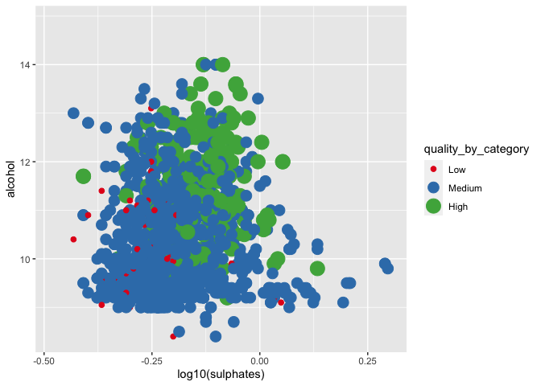

Data behind the plots
================
Alena Witzlack-Makarevich & Steven Moran
(26 October, 2022)

-   <a href="#data-set-data-matrix-tabular-data"
    id="toc-data-set-data-matrix-tabular-data">Data set, data matrix,
    tabular data</a>
-   <a href="#tabular-data" id="toc-tabular-data">Tabular data</a>
-   <a href="#case-study-red-wine-quality"
    id="toc-case-study-red-wine-quality">Case study: Red wine quality</a>
-   <a href="#case-study-come-fly-with-me"
    id="toc-case-study-come-fly-with-me">Case study: Come fly with me</a>
-   <a href="#more-resources" id="toc-more-resources">More resources</a>

# Data set, data matrix, tabular data

-   A data set (or dataset) is a collection of data.

-   Most commonly datasets come in the tabular format and correspond to
    the contents of a single database table, or a single statistical
    data matrix

-   The term data set may also be used more loosely, to refer to the
    data in a collection of closely related tables, corresponding to a
    particular experiment or event.

-   every column represents a particular variable (height, weight,
    number of letters, number of vowels, …)

-   each row/record corresponds to a given member of the data set in
    question (e.g. a person, a sentence, a language, a phoneme, a
    measurement, …)

-   Every record shares the same set of variables.

-   In other words: Every row has the same set of column headers.

-   Tabular data are inherently rectangular and cannot have “ragged
    rows”.

-   If any row is lacking information for a particular column a missing
    value (NA) must be stored in that cell.

-   Each value (each cell) is known as a datum.

# Tabular data


------------------------------------------------------------------------

# Case study: Red wine quality

Here is a paper about modeling wine preferences by using data mining on
physicochemical properties of wine:

-   <https://www.sciencedirect.com/science/article/abs/pii/S0167923609001377?via%3Dihub>

The authors aims to predict human wine taste preferences using a data
driven approach. They do so through regression modeling and model
selection techniques.

The dataset is available online:

-   <https://archive.ics.uci.edu/ml/datasets/wine+quality>
-   <https://www.kaggle.com/datasets/uciml/red-wine-quality-cortez-et-al-2009?select=winequality-red.csv>

You can find out more about the data types in dataset at these URLs,
e.g., residual sugar, citric acid, density.

Let’s load the data.

``` r
library(tidyverse)
```

    ## ── Attaching packages ─────────────────────────────────────── tidyverse 1.3.2 ──
    ## ✔ ggplot2 3.3.6      ✔ purrr   0.3.5 
    ## ✔ tibble  3.1.8      ✔ dplyr   1.0.10
    ## ✔ tidyr   1.2.1      ✔ stringr 1.4.1 
    ## ✔ readr   2.1.2      ✔ forcats 0.5.2 
    ## ── Conflicts ────────────────────────────────────────── tidyverse_conflicts() ──
    ## ✖ dplyr::filter() masks stats::filter()
    ## ✖ dplyr::lag()    masks stats::lag()

``` r
# We use read_delim to set the delimiter to ";"
red_wine <- read_delim('datasets/winequality-red.csv', delim = ";")
```

    ## Rows: 1599 Columns: 12
    ## ── Column specification ────────────────────────────────────────────────────────
    ## Delimiter: ";"
    ## dbl (12): fixed acidity, volatile acidity, citric acid, residual sugar, chlo...
    ## 
    ## ℹ Use `spec()` to retrieve the full column specification for this data.
    ## ℹ Specify the column types or set `show_col_types = FALSE` to quiet this message.

Let’s visualize aspects of the dataset. Here are some great examples:

-   <https://ksatola.github.io/projects/EDA_RedWineQuality_FinalwithCode.html>

We adapt them here. For example, quality of wine.

Here’s an example of a basic plot.

``` r
ggplot(data = red_wine, aes(x = quality)) +
  geom_histogram(binwidth = 1)
```

<!-- -->

``` r
  theme_bw()
```

    ## List of 93
    ##  $ line                      :List of 6
    ##   ..$ colour       : chr "black"
    ##   ..$ size         : num 0.5
    ##   ..$ linetype     : num 1
    ##   ..$ lineend      : chr "butt"
    ##   ..$ arrow        : logi FALSE
    ##   ..$ inherit.blank: logi TRUE
    ##   ..- attr(*, "class")= chr [1:2] "element_line" "element"
    ##  $ rect                      :List of 5
    ##   ..$ fill         : chr "white"
    ##   ..$ colour       : chr "black"
    ##   ..$ size         : num 0.5
    ##   ..$ linetype     : num 1
    ##   ..$ inherit.blank: logi TRUE
    ##   ..- attr(*, "class")= chr [1:2] "element_rect" "element"
    ##  $ text                      :List of 11
    ##   ..$ family       : chr ""
    ##   ..$ face         : chr "plain"
    ##   ..$ colour       : chr "black"
    ##   ..$ size         : num 11
    ##   ..$ hjust        : num 0.5
    ##   ..$ vjust        : num 0.5
    ##   ..$ angle        : num 0
    ##   ..$ lineheight   : num 0.9
    ##   ..$ margin       : 'margin' num [1:4] 0points 0points 0points 0points
    ##   .. ..- attr(*, "unit")= int 8
    ##   ..$ debug        : logi FALSE
    ##   ..$ inherit.blank: logi TRUE
    ##   ..- attr(*, "class")= chr [1:2] "element_text" "element"
    ##  $ title                     : NULL
    ##  $ aspect.ratio              : NULL
    ##  $ axis.title                : NULL
    ##  $ axis.title.x              :List of 11
    ##   ..$ family       : NULL
    ##   ..$ face         : NULL
    ##   ..$ colour       : NULL
    ##   ..$ size         : NULL
    ##   ..$ hjust        : NULL
    ##   ..$ vjust        : num 1
    ##   ..$ angle        : NULL
    ##   ..$ lineheight   : NULL
    ##   ..$ margin       : 'margin' num [1:4] 2.75points 0points 0points 0points
    ##   .. ..- attr(*, "unit")= int 8
    ##   ..$ debug        : NULL
    ##   ..$ inherit.blank: logi TRUE
    ##   ..- attr(*, "class")= chr [1:2] "element_text" "element"
    ##  $ axis.title.x.top          :List of 11
    ##   ..$ family       : NULL
    ##   ..$ face         : NULL
    ##   ..$ colour       : NULL
    ##   ..$ size         : NULL
    ##   ..$ hjust        : NULL
    ##   ..$ vjust        : num 0
    ##   ..$ angle        : NULL
    ##   ..$ lineheight   : NULL
    ##   ..$ margin       : 'margin' num [1:4] 0points 0points 2.75points 0points
    ##   .. ..- attr(*, "unit")= int 8
    ##   ..$ debug        : NULL
    ##   ..$ inherit.blank: logi TRUE
    ##   ..- attr(*, "class")= chr [1:2] "element_text" "element"
    ##  $ axis.title.x.bottom       : NULL
    ##  $ axis.title.y              :List of 11
    ##   ..$ family       : NULL
    ##   ..$ face         : NULL
    ##   ..$ colour       : NULL
    ##   ..$ size         : NULL
    ##   ..$ hjust        : NULL
    ##   ..$ vjust        : num 1
    ##   ..$ angle        : num 90
    ##   ..$ lineheight   : NULL
    ##   ..$ margin       : 'margin' num [1:4] 0points 2.75points 0points 0points
    ##   .. ..- attr(*, "unit")= int 8
    ##   ..$ debug        : NULL
    ##   ..$ inherit.blank: logi TRUE
    ##   ..- attr(*, "class")= chr [1:2] "element_text" "element"
    ##  $ axis.title.y.left         : NULL
    ##  $ axis.title.y.right        :List of 11
    ##   ..$ family       : NULL
    ##   ..$ face         : NULL
    ##   ..$ colour       : NULL
    ##   ..$ size         : NULL
    ##   ..$ hjust        : NULL
    ##   ..$ vjust        : num 0
    ##   ..$ angle        : num -90
    ##   ..$ lineheight   : NULL
    ##   ..$ margin       : 'margin' num [1:4] 0points 0points 0points 2.75points
    ##   .. ..- attr(*, "unit")= int 8
    ##   ..$ debug        : NULL
    ##   ..$ inherit.blank: logi TRUE
    ##   ..- attr(*, "class")= chr [1:2] "element_text" "element"
    ##  $ axis.text                 :List of 11
    ##   ..$ family       : NULL
    ##   ..$ face         : NULL
    ##   ..$ colour       : chr "grey30"
    ##   ..$ size         : 'rel' num 0.8
    ##   ..$ hjust        : NULL
    ##   ..$ vjust        : NULL
    ##   ..$ angle        : NULL
    ##   ..$ lineheight   : NULL
    ##   ..$ margin       : NULL
    ##   ..$ debug        : NULL
    ##   ..$ inherit.blank: logi TRUE
    ##   ..- attr(*, "class")= chr [1:2] "element_text" "element"
    ##  $ axis.text.x               :List of 11
    ##   ..$ family       : NULL
    ##   ..$ face         : NULL
    ##   ..$ colour       : NULL
    ##   ..$ size         : NULL
    ##   ..$ hjust        : NULL
    ##   ..$ vjust        : num 1
    ##   ..$ angle        : NULL
    ##   ..$ lineheight   : NULL
    ##   ..$ margin       : 'margin' num [1:4] 2.2points 0points 0points 0points
    ##   .. ..- attr(*, "unit")= int 8
    ##   ..$ debug        : NULL
    ##   ..$ inherit.blank: logi TRUE
    ##   ..- attr(*, "class")= chr [1:2] "element_text" "element"
    ##  $ axis.text.x.top           :List of 11
    ##   ..$ family       : NULL
    ##   ..$ face         : NULL
    ##   ..$ colour       : NULL
    ##   ..$ size         : NULL
    ##   ..$ hjust        : NULL
    ##   ..$ vjust        : num 0
    ##   ..$ angle        : NULL
    ##   ..$ lineheight   : NULL
    ##   ..$ margin       : 'margin' num [1:4] 0points 0points 2.2points 0points
    ##   .. ..- attr(*, "unit")= int 8
    ##   ..$ debug        : NULL
    ##   ..$ inherit.blank: logi TRUE
    ##   ..- attr(*, "class")= chr [1:2] "element_text" "element"
    ##  $ axis.text.x.bottom        : NULL
    ##  $ axis.text.y               :List of 11
    ##   ..$ family       : NULL
    ##   ..$ face         : NULL
    ##   ..$ colour       : NULL
    ##   ..$ size         : NULL
    ##   ..$ hjust        : num 1
    ##   ..$ vjust        : NULL
    ##   ..$ angle        : NULL
    ##   ..$ lineheight   : NULL
    ##   ..$ margin       : 'margin' num [1:4] 0points 2.2points 0points 0points
    ##   .. ..- attr(*, "unit")= int 8
    ##   ..$ debug        : NULL
    ##   ..$ inherit.blank: logi TRUE
    ##   ..- attr(*, "class")= chr [1:2] "element_text" "element"
    ##  $ axis.text.y.left          : NULL
    ##  $ axis.text.y.right         :List of 11
    ##   ..$ family       : NULL
    ##   ..$ face         : NULL
    ##   ..$ colour       : NULL
    ##   ..$ size         : NULL
    ##   ..$ hjust        : num 0
    ##   ..$ vjust        : NULL
    ##   ..$ angle        : NULL
    ##   ..$ lineheight   : NULL
    ##   ..$ margin       : 'margin' num [1:4] 0points 0points 0points 2.2points
    ##   .. ..- attr(*, "unit")= int 8
    ##   ..$ debug        : NULL
    ##   ..$ inherit.blank: logi TRUE
    ##   ..- attr(*, "class")= chr [1:2] "element_text" "element"
    ##  $ axis.ticks                :List of 6
    ##   ..$ colour       : chr "grey20"
    ##   ..$ size         : NULL
    ##   ..$ linetype     : NULL
    ##   ..$ lineend      : NULL
    ##   ..$ arrow        : logi FALSE
    ##   ..$ inherit.blank: logi TRUE
    ##   ..- attr(*, "class")= chr [1:2] "element_line" "element"
    ##  $ axis.ticks.x              : NULL
    ##  $ axis.ticks.x.top          : NULL
    ##  $ axis.ticks.x.bottom       : NULL
    ##  $ axis.ticks.y              : NULL
    ##  $ axis.ticks.y.left         : NULL
    ##  $ axis.ticks.y.right        : NULL
    ##  $ axis.ticks.length         : 'simpleUnit' num 2.75points
    ##   ..- attr(*, "unit")= int 8
    ##  $ axis.ticks.length.x       : NULL
    ##  $ axis.ticks.length.x.top   : NULL
    ##  $ axis.ticks.length.x.bottom: NULL
    ##  $ axis.ticks.length.y       : NULL
    ##  $ axis.ticks.length.y.left  : NULL
    ##  $ axis.ticks.length.y.right : NULL
    ##  $ axis.line                 : list()
    ##   ..- attr(*, "class")= chr [1:2] "element_blank" "element"
    ##  $ axis.line.x               : NULL
    ##  $ axis.line.x.top           : NULL
    ##  $ axis.line.x.bottom        : NULL
    ##  $ axis.line.y               : NULL
    ##  $ axis.line.y.left          : NULL
    ##  $ axis.line.y.right         : NULL
    ##  $ legend.background         :List of 5
    ##   ..$ fill         : NULL
    ##   ..$ colour       : logi NA
    ##   ..$ size         : NULL
    ##   ..$ linetype     : NULL
    ##   ..$ inherit.blank: logi TRUE
    ##   ..- attr(*, "class")= chr [1:2] "element_rect" "element"
    ##  $ legend.margin             : 'margin' num [1:4] 5.5points 5.5points 5.5points 5.5points
    ##   ..- attr(*, "unit")= int 8
    ##  $ legend.spacing            : 'simpleUnit' num 11points
    ##   ..- attr(*, "unit")= int 8
    ##  $ legend.spacing.x          : NULL
    ##  $ legend.spacing.y          : NULL
    ##  $ legend.key                :List of 5
    ##   ..$ fill         : chr "white"
    ##   ..$ colour       : logi NA
    ##   ..$ size         : NULL
    ##   ..$ linetype     : NULL
    ##   ..$ inherit.blank: logi TRUE
    ##   ..- attr(*, "class")= chr [1:2] "element_rect" "element"
    ##  $ legend.key.size           : 'simpleUnit' num 1.2lines
    ##   ..- attr(*, "unit")= int 3
    ##  $ legend.key.height         : NULL
    ##  $ legend.key.width          : NULL
    ##  $ legend.text               :List of 11
    ##   ..$ family       : NULL
    ##   ..$ face         : NULL
    ##   ..$ colour       : NULL
    ##   ..$ size         : 'rel' num 0.8
    ##   ..$ hjust        : NULL
    ##   ..$ vjust        : NULL
    ##   ..$ angle        : NULL
    ##   ..$ lineheight   : NULL
    ##   ..$ margin       : NULL
    ##   ..$ debug        : NULL
    ##   ..$ inherit.blank: logi TRUE
    ##   ..- attr(*, "class")= chr [1:2] "element_text" "element"
    ##  $ legend.text.align         : NULL
    ##  $ legend.title              :List of 11
    ##   ..$ family       : NULL
    ##   ..$ face         : NULL
    ##   ..$ colour       : NULL
    ##   ..$ size         : NULL
    ##   ..$ hjust        : num 0
    ##   ..$ vjust        : NULL
    ##   ..$ angle        : NULL
    ##   ..$ lineheight   : NULL
    ##   ..$ margin       : NULL
    ##   ..$ debug        : NULL
    ##   ..$ inherit.blank: logi TRUE
    ##   ..- attr(*, "class")= chr [1:2] "element_text" "element"
    ##  $ legend.title.align        : NULL
    ##  $ legend.position           : chr "right"
    ##  $ legend.direction          : NULL
    ##  $ legend.justification      : chr "center"
    ##  $ legend.box                : NULL
    ##  $ legend.box.just           : NULL
    ##  $ legend.box.margin         : 'margin' num [1:4] 0cm 0cm 0cm 0cm
    ##   ..- attr(*, "unit")= int 1
    ##  $ legend.box.background     : list()
    ##   ..- attr(*, "class")= chr [1:2] "element_blank" "element"
    ##  $ legend.box.spacing        : 'simpleUnit' num 11points
    ##   ..- attr(*, "unit")= int 8
    ##  $ panel.background          :List of 5
    ##   ..$ fill         : chr "white"
    ##   ..$ colour       : logi NA
    ##   ..$ size         : NULL
    ##   ..$ linetype     : NULL
    ##   ..$ inherit.blank: logi TRUE
    ##   ..- attr(*, "class")= chr [1:2] "element_rect" "element"
    ##  $ panel.border              :List of 5
    ##   ..$ fill         : logi NA
    ##   ..$ colour       : chr "grey20"
    ##   ..$ size         : NULL
    ##   ..$ linetype     : NULL
    ##   ..$ inherit.blank: logi TRUE
    ##   ..- attr(*, "class")= chr [1:2] "element_rect" "element"
    ##  $ panel.spacing             : 'simpleUnit' num 5.5points
    ##   ..- attr(*, "unit")= int 8
    ##  $ panel.spacing.x           : NULL
    ##  $ panel.spacing.y           : NULL
    ##  $ panel.grid                :List of 6
    ##   ..$ colour       : chr "grey92"
    ##   ..$ size         : NULL
    ##   ..$ linetype     : NULL
    ##   ..$ lineend      : NULL
    ##   ..$ arrow        : logi FALSE
    ##   ..$ inherit.blank: logi TRUE
    ##   ..- attr(*, "class")= chr [1:2] "element_line" "element"
    ##  $ panel.grid.major          : NULL
    ##  $ panel.grid.minor          :List of 6
    ##   ..$ colour       : NULL
    ##   ..$ size         : 'rel' num 0.5
    ##   ..$ linetype     : NULL
    ##   ..$ lineend      : NULL
    ##   ..$ arrow        : logi FALSE
    ##   ..$ inherit.blank: logi TRUE
    ##   ..- attr(*, "class")= chr [1:2] "element_line" "element"
    ##  $ panel.grid.major.x        : NULL
    ##  $ panel.grid.major.y        : NULL
    ##  $ panel.grid.minor.x        : NULL
    ##  $ panel.grid.minor.y        : NULL
    ##  $ panel.ontop               : logi FALSE
    ##  $ plot.background           :List of 5
    ##   ..$ fill         : NULL
    ##   ..$ colour       : chr "white"
    ##   ..$ size         : NULL
    ##   ..$ linetype     : NULL
    ##   ..$ inherit.blank: logi TRUE
    ##   ..- attr(*, "class")= chr [1:2] "element_rect" "element"
    ##  $ plot.title                :List of 11
    ##   ..$ family       : NULL
    ##   ..$ face         : NULL
    ##   ..$ colour       : NULL
    ##   ..$ size         : 'rel' num 1.2
    ##   ..$ hjust        : num 0
    ##   ..$ vjust        : num 1
    ##   ..$ angle        : NULL
    ##   ..$ lineheight   : NULL
    ##   ..$ margin       : 'margin' num [1:4] 0points 0points 5.5points 0points
    ##   .. ..- attr(*, "unit")= int 8
    ##   ..$ debug        : NULL
    ##   ..$ inherit.blank: logi TRUE
    ##   ..- attr(*, "class")= chr [1:2] "element_text" "element"
    ##  $ plot.title.position       : chr "panel"
    ##  $ plot.subtitle             :List of 11
    ##   ..$ family       : NULL
    ##   ..$ face         : NULL
    ##   ..$ colour       : NULL
    ##   ..$ size         : NULL
    ##   ..$ hjust        : num 0
    ##   ..$ vjust        : num 1
    ##   ..$ angle        : NULL
    ##   ..$ lineheight   : NULL
    ##   ..$ margin       : 'margin' num [1:4] 0points 0points 5.5points 0points
    ##   .. ..- attr(*, "unit")= int 8
    ##   ..$ debug        : NULL
    ##   ..$ inherit.blank: logi TRUE
    ##   ..- attr(*, "class")= chr [1:2] "element_text" "element"
    ##  $ plot.caption              :List of 11
    ##   ..$ family       : NULL
    ##   ..$ face         : NULL
    ##   ..$ colour       : NULL
    ##   ..$ size         : 'rel' num 0.8
    ##   ..$ hjust        : num 1
    ##   ..$ vjust        : num 1
    ##   ..$ angle        : NULL
    ##   ..$ lineheight   : NULL
    ##   ..$ margin       : 'margin' num [1:4] 5.5points 0points 0points 0points
    ##   .. ..- attr(*, "unit")= int 8
    ##   ..$ debug        : NULL
    ##   ..$ inherit.blank: logi TRUE
    ##   ..- attr(*, "class")= chr [1:2] "element_text" "element"
    ##  $ plot.caption.position     : chr "panel"
    ##  $ plot.tag                  :List of 11
    ##   ..$ family       : NULL
    ##   ..$ face         : NULL
    ##   ..$ colour       : NULL
    ##   ..$ size         : 'rel' num 1.2
    ##   ..$ hjust        : num 0.5
    ##   ..$ vjust        : num 0.5
    ##   ..$ angle        : NULL
    ##   ..$ lineheight   : NULL
    ##   ..$ margin       : NULL
    ##   ..$ debug        : NULL
    ##   ..$ inherit.blank: logi TRUE
    ##   ..- attr(*, "class")= chr [1:2] "element_text" "element"
    ##  $ plot.tag.position         : chr "topleft"
    ##  $ plot.margin               : 'margin' num [1:4] 5.5points 5.5points 5.5points 5.5points
    ##   ..- attr(*, "unit")= int 8
    ##  $ strip.background          :List of 5
    ##   ..$ fill         : chr "grey85"
    ##   ..$ colour       : chr "grey20"
    ##   ..$ size         : NULL
    ##   ..$ linetype     : NULL
    ##   ..$ inherit.blank: logi TRUE
    ##   ..- attr(*, "class")= chr [1:2] "element_rect" "element"
    ##  $ strip.background.x        : NULL
    ##  $ strip.background.y        : NULL
    ##  $ strip.placement           : chr "inside"
    ##  $ strip.text                :List of 11
    ##   ..$ family       : NULL
    ##   ..$ face         : NULL
    ##   ..$ colour       : chr "grey10"
    ##   ..$ size         : 'rel' num 0.8
    ##   ..$ hjust        : NULL
    ##   ..$ vjust        : NULL
    ##   ..$ angle        : NULL
    ##   ..$ lineheight   : NULL
    ##   ..$ margin       : 'margin' num [1:4] 4.4points 4.4points 4.4points 4.4points
    ##   .. ..- attr(*, "unit")= int 8
    ##   ..$ debug        : NULL
    ##   ..$ inherit.blank: logi TRUE
    ##   ..- attr(*, "class")= chr [1:2] "element_text" "element"
    ##  $ strip.text.x              : NULL
    ##  $ strip.text.y              :List of 11
    ##   ..$ family       : NULL
    ##   ..$ face         : NULL
    ##   ..$ colour       : NULL
    ##   ..$ size         : NULL
    ##   ..$ hjust        : NULL
    ##   ..$ vjust        : NULL
    ##   ..$ angle        : num -90
    ##   ..$ lineheight   : NULL
    ##   ..$ margin       : NULL
    ##   ..$ debug        : NULL
    ##   ..$ inherit.blank: logi TRUE
    ##   ..- attr(*, "class")= chr [1:2] "element_text" "element"
    ##  $ strip.switch.pad.grid     : 'simpleUnit' num 2.75points
    ##   ..- attr(*, "unit")= int 8
    ##  $ strip.switch.pad.wrap     : 'simpleUnit' num 2.75points
    ##   ..- attr(*, "unit")= int 8
    ##  $ strip.text.y.left         :List of 11
    ##   ..$ family       : NULL
    ##   ..$ face         : NULL
    ##   ..$ colour       : NULL
    ##   ..$ size         : NULL
    ##   ..$ hjust        : NULL
    ##   ..$ vjust        : NULL
    ##   ..$ angle        : num 90
    ##   ..$ lineheight   : NULL
    ##   ..$ margin       : NULL
    ##   ..$ debug        : NULL
    ##   ..$ inherit.blank: logi TRUE
    ##   ..- attr(*, "class")= chr [1:2] "element_text" "element"
    ##  - attr(*, "class")= chr [1:2] "theme" "gg"
    ##  - attr(*, "complete")= logi TRUE
    ##  - attr(*, "validate")= logi TRUE

Here is one that is a bit more elegantly portrayed.

``` r
ggplot(data = red_wine, aes(x = quality)) +
  geom_histogram(color = 'black', fill = '#099DD9', binwidth = 1) +
  # Used to show 0-10 range, even if there are no values close to 0 or 10
  scale_x_continuous(limits = c(0, 10), breaks = seq(0, 10, 1)) +
  xlab('Quality of Red Wine') +
  ylab('Number of Red Wines') +
  theme_bw()
```

    ## Warning: Removed 2 rows containing missing values (geom_bar).

<!-- -->

Some questions:

-   What is the data type?
-   What does the plot tell us about the quality of the wine in the
    dataset?

We can also split the wine into categories.

``` r
# Set boundaries for intervals
breaks <- c(0, 5, 7, 10)

# Bucket data points into intervals
red_wine$quality_by_category <- cut(red_wine$quality, breaks, include.lowest = TRUE, right = FALSE)

# Check intervals
summary(red_wine$quality_by_category)
```

    ##  [0,5)  [5,7) [7,10] 
    ##     63   1319    217

And add some labels.

``` r
# Add labels to intervals
labels <- c("Low", "Medium", "High")
red_wine$quality_by_category <- cut(red_wine$quality, breaks, include.lowest = TRUE, right = FALSE, labels=labels)

# Check if labels are applied properly
table(red_wine$quality_by_category)
```

    ## 
    ##    Low Medium   High 
    ##     63   1319    217

And a visualization.

``` r
y <- cbind(red_wine, red_wine$quality_by_category)
ggplot(data = y, aes(x = y$quality_by_category, fill = ..count..)) + 
  geom_bar(color = 'black', alpha = 0.9) + 
  # Add text labels with number of rows in each category
  theme_bw() + 
  labs(y = "Number of Observations", x = "Red Wine Quality Category") +
  # Make the plot horizontal
  # Limit y axis
  ylim(0, 2000) +
  # Include bins of length zero
  scale_x_discrete(drop = FALSE) 
```

    ## Warning: Use of `y$quality_by_category` is discouraged. Use
    ## `quality_by_category` instead.

<!-- -->

Rating by fixed acidity.

``` r
ggplot(data = red_wine, aes(x = quality_by_category, y = `fixed acidity`, color = quality_by_category)) + geom_boxplot()
```

<!-- -->

Rating by residual sugar.

``` r
ggplot(data = red_wine, aes(x = quality_by_category, y = `residual sugar`, color = quality_by_category)) + geom_boxplot()
```

<!-- -->

Sulphates and alcohol.

``` r
ggplot(aes(x = log10(sulphates), y = alcohol, colour = quality_by_category), 
       data = red_wine) + 
  geom_point(aes(size = quality_by_category)) +
  scale_color_brewer(type = 'div', palette="Set1") +
  scale_x_continuous(lim=c(quantile(log10(red_wine$sulphates), 0.00001),
                           quantile(log10(red_wine$sulphates), 0.99999)))+
  scale_y_continuous(lim=c(quantile(red_wine$alcohol, 0.00001),
                           quantile(red_wine$alcohol, 0.99999))) 
```

    ## Warning: Using size for a discrete variable is not advised.

    ## Warning: Removed 3 rows containing missing values (geom_point).

<!-- -->

Fixed acidity and density.

``` r
ggplot(aes(x = `fixed acidity`, y = density, colour = quality_by_category), 
       data = red_wine) + 
  geom_point(size = 4) +
  #geom_point() +
  scale_color_brewer(type = 'div', palette="Set1") +
  scale_x_continuous(lim=c(quantile(red_wine$`fixed acidity`, 0.0001),
                           quantile(red_wine$`fixed acidity`, 0.9999))) +
  scale_y_continuous(lim=c(quantile(red_wine$density, 0.0001),
                           quantile(red_wine$density, 0.9999)))
```

    ## Warning: Removed 2 rows containing missing values (geom_point).

<!-- -->

# Case study: Come fly with me

Which airlines should you travel with – and which should you avoid? We
sift through the data so you don’t have to (JAMES TOZER \| APRIL/MAY
2016)

-   <https://www.1843magazine.com/travel/what-the-numbers-say/come-fly-with-me>

> > > Asia’s airlines are mostly excellent; Europe’s are competent;
> > > America’s are awful. It is a pattern that many globetrotters have
> > > observed, but which we have confirmed by trawling through data on
> > > 18 major international carriers.

> > > We used flight-volume data from FlightStats.com and
> > > customer-satisfaction data from Skytrax, an airline consultancy
> > > which asks users to mark carriers out of five for the quality of
> > > their food, service, comfort, in-flight entertainment and value
> > > for money. American and United each scored 2.17 – barely half as
> > > much as leaders ANA and Singapore Airlines, both rated at 4.17.

> > > For prices, we took the world’s 30 busiest airports in the last
> > > quarter of 2015, and analyzed direct flights between them on
> > > week-long return trips from a sample at the start of August 2016.
> > > Most of the 870 routes we looked at had a cheapest option, but
> > > across the whole sample few companies were able to charge much
> > > more or less than their rivals – as you would expect in a
> > > competitive market.

> > > With so little difference in prices between airlines, the savvy
> > > traveller might as well opt for the comfiest seats, not the
> > > cheapest ones – and plump for Asian luxury over shoddy American
> > > service.

-   Which airlines should you travel with – and which should you avoid?
-   We sift through the data so you don’t have to Asia’s airlines are
    mostly excellent; Europe’s are competent; America’s are awful.
-   For prices, we took the world’s 30 busiest airports in the last
    quarter of 2015, and analyzed direct flights between them on
    week-long return trips from a sample at the start of August 2016.

Sketch the data matrix which could have been used to produce this plot:


------------------------------------------------------------------------

Recall “Aesthetics”:

> > > aesthetic \< Gr. aisthētikos \< aisthēta ‘perceptible things’ \<
> > > aisthesthai ‘perceive’

In statistical graphics (specifically in the ggplot sense) this old
usage is meant: aesthetics are principles for relating sensory
attributes (color, shape, sound, etc.) to variables.

In modern usage (since mid 18th c., first in Ger. and then in Eng.),
aesthetics can also mean taste or beauty.

-   In a plot one aesthetic attribute can represent one variable

-   Sophisticated plots combine various aesthetic attributes (color,
    shape, line type, size, position, transparency, text, etc.) to
    represent multiple variables at ones

Which aesthetic attributes stand for what variable:

\_\_\_\_\_\_\_\_\_\_\_ represents \_\_\_\_\_\_\_\_\_\_\_\_

\_\_\_\_\_\_\_\_\_\_\_ represents \_\_\_\_\_\_\_\_\_\_\_\_

\_\_\_\_\_\_\_\_\_\_\_ represents \_\_\_\_\_\_\_\_\_\_\_\_

\_\_\_\_\_\_\_\_\_\_\_ represents \_\_\_\_\_\_\_\_\_\_\_\_

\_\_\_\_\_\_\_\_\_\_\_ represents \_\_\_\_\_\_\_\_\_\_\_\_

# More resources

-   <https://www.1843magazine.com/data-graphic/what-the-numbers-say/higher-earning>

-   <https://www.economist.com/1843/2016/05/06/where-to-buy>

-   <https://pudding.cool/2020/02/authors/>

-   <https://pudding.cool/2020/10/kpop/>

-   <https://pudding.cool/2018/08/filmordigital/>

-   <https://pudding.cool/2019/02/dress-code-sexualization/>

-   <https://pudding.cool/projects/vocabulary/>

-   <https://pudding.cool/2019/10/laugh/>

-   <https://pudding.cool/2017/03/film-dialogue/>

-   <https://pudding.cool/2019/05/names-in-songs/>

-   <https://pudding.cool/2019/11/big-hair/>

-   <https://pudding.cool/2017/08/screen-direction/>

-   <https://pudding.cool/2019/04/vogue/>
