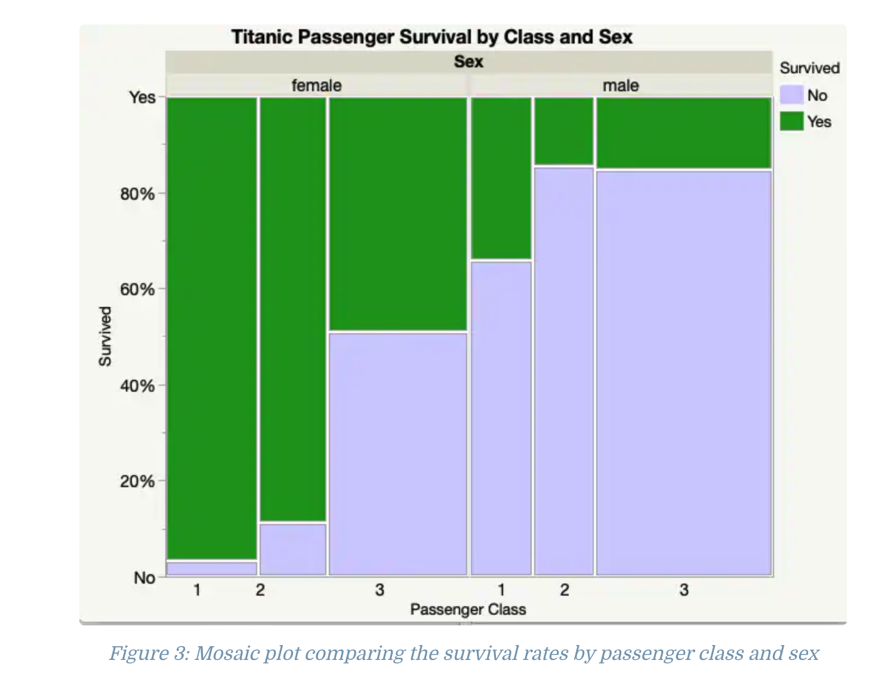

Recall the lecture on [data types in computer programming](https://github.com/bambooforest/IntroDataScience/tree/main/3_data#data-types-in-computer-programming) and [data types in statistics](https://github.com/bambooforest/IntroDataScience/tree/main/3_data#data-types-in-statistics).

In sum:

* Data in software is classified by type
* These types signal the operations that the software can do on these data (e.g., sort text, do arithmetic on numbers)
* Data types can overlap between software and statistical data types

All programming languages have basic data types. In R, these include:

* Numeric
* Integer
* Complex
* Logical
* Character

Read more about them here:

* http://www.r-tutor.com/r-introduction/basic-data-types

There is also the data type `vector` in R. A vector contains a sequence of items of the same type (from above). Because software needs to operate on data types in different ways, e.g., you can't really "add" letters, instead you add numbers), they will often be "encoded" in different ways within the syntax of the programming language you are working on. 

In R for example, a vector of numbers are declared within the `c()` function simply as:

```{r}
c(1, 2, 3)

ID <- c(1, 2, 3) # assign the vector to a variable
class(ID) # tell me the data type of the variable x
```

Logical values:

```{r}
c(TRUE, FALSE, TRUE)

Passed <- c(TRUE, FALSE, TRUE)
class(Passed)
```

A vector can also contain strings, i.e., text. Note strings in R need to be enclosed in either `' '` or `" "`. This is simply convention and text without it will fail.

```{r}
# Uncomment below to see how it fails (Error: object 'Steve' not found)
# c(Steve, Jack, Robert)
```

Let's not fail!

```{r}
c("Steve", "Jack", "Robert")

Student <- c("Steve", "Jack", "Robert")
class(Student)
```

The data frame in R is for storing data in table format. Recall our lectures on tabular data:

* https://github.com/bambooforest/IntroDataScience/tree/main/3_data#tabular-data
* https://github.com/bambooforest/IntroDataScience/tree/main/5_data_visualization#tabular-data

Much data in R -- or loaded into R -- comes in a tabular format and is loaded into a data frame data type with functions such as `read_csv()`, `read_excel()`, etc.

A data frame is a "list" of vectors of **equal** length. Each vector contains a single data type.

Let's make a data frame.

```{r}
df = data.frame(ID, Passed, Student)
df
```

The data frame is the typical data type for interacting with data that you load into R. The data frame is -- again -- a list of vectors of **equal** length. This will fail because if we try to create a data frame by combining vectors of different lengths.

```{r}
# Uncomment below to see how it fails (Error in data.frame(ID, Passed, Student, FavoriteColor) : arguments imply differing number of rows: 3, 4)
FavoriteColor <- c("Blue", "Green", "Red", "Purple")
# data.frame(ID, Passed, Student, FavoriteColor)
```

However, we can still combine any number of vectors **of different length** by storing them in a list data type (data structure) in R.

```{r}
list(ID, Passed, Student, FavoriteColor)
```

Like a data frame, you can access elements in the list (its vectors) or elements in the vectors in the list.

```{r}
my_list <- list(ID, Passed, Student, FavoriteColor)
my_list

my_list[1]
my_list[2]
my_list[3]
```

Why is this important to know?

Whereas in this class you are most likely to work with a data frame because you load some set of tabular data into R, there are plenty of datasets that are not in data frames. Instead, they have been encoded in lists.

Let's look at an example.

Recall the list of built in datasets in R:

* https://stat.ethz.ch/R-manual/R-devel/library/datasets/html/00Index.html

Let's look at the one called Titanic. Here is the description.

* https://stat.ethz.ch/R-manual/R-devel/library/datasets/html/Titanic.html

You can load the data into the R working space with the `data()` function.

```{r}
data(Titanic)
```

If you want to access the documentation of a data set in R, use the `help()` function:

```{r}
help("Titanic")
```

It says the data format is:

>>> "A 4-dimensional array resulting from cross-tabulating 2201 observations on 4 variables. The variables and their levels are as follows:"


| No | Name | Levels |
|:---|:-----|:-------|
| 1 | Class | 1st, 2nd, 3rd, Crew |
| 2 | Sex | Male, Female |
| 3 | Age | Child, Adult |
| 4 | Survived| No, Yes |

So it's not a data frame? Let's ask it.

```{r}
class(Titanic)
```

Hmm, what does it look like? Eeks! There seem to be four "tables" of counts by the number of survivors, by variables such as what class they had booked, their sex, age, and whether or not they survived [the sinking of the Titanic](https://en.wikipedia.org/wiki/Sinking_of_the_Titanic).

```{r}
Titanic
```

What is its structure?

```{r}
str(Titanic)
```

So, what it is a table? Tables in R are a data type (data structure) that lend themselves well to particular functions. For example, at the end of the `help(Titantic)` documentation, there are some code examples that take as input the data type **table**.

One such function for visualization is `mosaicplot()` in base R, which simply takes `Titanic` as input.

```{r}
mosaicplot(Titanic, main = "Survival on the Titanic")
```

The [mosaic plot](https://en.wikipedia.org/wiki/Mosaic_plot) (aka [Marimekko chart](https://en.wikipedia.org/wiki/Marimekko)) is a visualization of two or more qualitative values. It's a kind of stacked bar chart, but shows percentages by groups to compare them.

What do we see in the mosaic plot above from the Titanic data?

Not all plots are easy to read. Consider this mosaic plot comparing the survival rates by passenger and class:



* https://www.jmp.com/en_us/statistics-knowledge-portal/exploratory-data-analysis/mosaic-plot.html

Now what patterns do you see? Are they meaningful?

***

How would we recreate the plot above? Can you do it with the same built in data type? One way to begin to explore is to investigate how the `mosaicplot()` function works!

```{r}
help(mosaicplot)
```

Most methods have some [default settings](https://en.wikipedia.org/wiki/Default_(computer_science)) that can be overwritten or changed.

But what if you want to explore more of the Titanic data than the built in cross-tabulated available within R?

Search for it!

* [r titantic data convert to dataframe](https://www.google.com/search?q=r+titanic+data+convert+to+dataframe)

Well, there are lots of potentially useful results for one to look through!

* [Data Wrangling the Titanic Dataset](https://rpubs.com/CBezz/DataWranglingTheTitanicDataset)
* [How to transform the Titanic data set](https://stackoverflow.com/questions/59447399/how-to-transform-the-titanic-data-set)
* [explore Titanic](https://cran.r-project.org/web/packages/explore/vignettes/explore_titanic.html)
* [A beginner's guide to learning R with the Titanic dataset](https://medium.com/analytics-vidhya/a-beginners-guide-to-learning-r-with-the-titanic-dataset-a630bc5495a8)
* [Diving into the tidyverse Using Titanic Data](https://towardsdatascience.com/diving-into-the-tidyverse-using-the-titanic-data-83f54295d5df)

And if you look through these reports a bit -- and/or search for raw data -- you will find it!

* [titanic raw dataset](https://www.google.com/search?q=titanic+raw+dataset)

Lots of data out there:

* https://github.com/datasciencedojo/datasets/blob/master/titanic.csv
* https://osf.io/aupb4
* https://github.com/bio304-class/bio304-course-notes/blob/master/datasets/titanic_data.csv

And of course if you need ideas or what to see what's already been done, come up with some searches based on what you read and what you're interested in knowing.

* [r titantic passenger surival by class and sex](https://www.google.com/search?q=r+titantic+passenger+surival+by+class+and+sex)

Lots of studies with reproducible code and data. Learning to read code and understanding what visualizations and statistical analyses make sense given the data at hand is a skill that is developed through study and practice. Here are some examples:

* [Titanic Survivability Analysis with R](https://rpubs.com/dharmendrapuri/titanic)
* [Surviving the Titanic Disaster as a Function of Sex and Passenger Class](https://rstudio-pubs-static.s3.amazonaws.com/430395_6ae5b146bbed4dbfa1efecec212d0332.html)
* [Data Exploration: The Titanic](https://bio304-class.github.io/bio304-fall2017/data-story-titanic.html)

Lastly, just because there is a built in data set in R in the `datasets` package, doesn't mean there aren't **other** ways of accessing the data in R (this won't always be the case, but the Titanic data -- for obvious reasons -- has been studied for more than 120 years).

Recall that there are lots of R packages that include methods and sometimes also code. They are available here:

* https://cran.r-project.org/web/packages/available_packages_by_name.html

Of course you need to do the usual install the package(s) (once) and then load them with the `library()` function (each time you run your code).

Here's an example from a R package that is called [titanic](https://cran.r-project.org/web/packages/titanic/index.html):

```{r}
# install.packages('titanic') # commented because it only needs to run once!
```

Well, what's in this package -- it's a **package** not a built in data set.

```{r}
library(titanic)
help(titanic)
```

Hmm, let's have a look. Help unfortunately isn't too helpful (a reason why it's important to document your work!). Each R package, however, must have a reference manual -- note may also not be so helpful, but usually gives more information than the brief description on the package's page:

* https://cran.r-project.org/web/packages/titanic/index.html
* https://cran.r-project.org/web/packages/titanic/titanic.pdf

So does it have the data you're interested in? Or maybe better to use other data?
